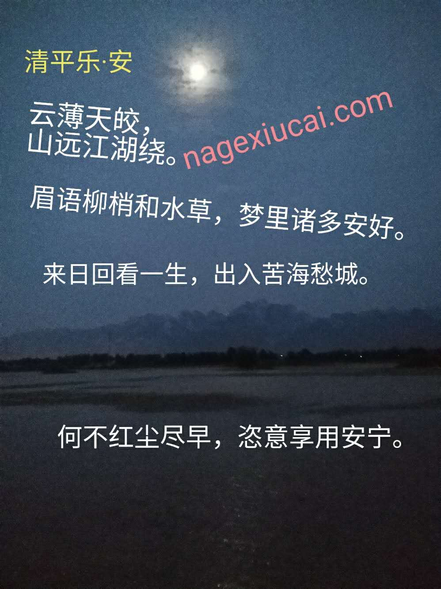

# <a id="home">疯子一样的诗词</a> #

- 现体
  - [为什么](#why)
  - [心意](#will)
  - [致嫦娥](#for-chinese-luna)
  - [一点想法](#a-bit-thought)
  - [美丽心情不见了](#beautiful-emotion-has-gone)
  - [对不起](#sorry)
  - [难得易失](#hard-get-easy-loss)
  - [迷失](#lost)
  - [随想](#wander)
  - [当爱已成恨](#when-love-becomes-hate)
  - [兀自](#what-a-fuck)
  - [忧伤](#sorrow)
  - [最烂的](#slush)
  - [十一月的莎士比亚](#shakespeare-in-november)
  - [快乐、忧伤](#happy-sorrow)
  - [旧文选段·其一](#old-pour-sample-one)
  - [妈妈煮的面](#mothers-noodle)
  - [你的味道、你的发香](#flavor-hair)
  - [爱，没道理](#love-without-reason)
  - [说什么好呢](#no-words)
  - [过年 · 初四有会](#compose-hold-and-leave-of-liutao)
  - [从科技二路到科技八路](#from-techiiroad-to-techviiithroad)
  - [花廊下的男人](#the-guy-under-flower-corridor)
  - [狗剩跑摩的](#goushengs-motorcycle)
  - [人和鸟有什么分别](#being-bird)
  - [人生相逢](#love)
  - [大叔的小清晰](#love)
  - [小目标](#dream)
  - [华为的男生女生](#huaweiers)

- 骈体
  - [发骚](#rut)
  - [黑社会——反诗](#reaction)
  - [情人节致姐姐姐夫](#for-elder-sister-and-her-lover-on-valentines-day)
  - [卧榻自嘲](#self-mockery-in-bed)
  - [为安君寿](#congratulations-for-anyonggang)
  - [凤仪黄鹤楼](#phoenix-liwenjing-comes-to-yellow-crane-tower)
  - [蝶恋花——油菜花](#rape-flower-haoyuanfeng)
  - [问道泰山](#mount-tai-zhangsongtian)
  - [蝶恋花——送旧人](#for-classmate-gaoqiao)
  - [虞美人——眼前美女来来往往](#for-classmate-renting)
  - [卜算子——愿君如意](#for-classmate-haoju-bachelor)
  - [雪峪游仙](#for-classmate-haoju-xianyu)
  - [一剪梅——思念](#for-classmate-zhaoyanjun-bachelor)
  - [玉楼春——劝解](#for-classmate-zhaoyanjun-lovelorn)
  - [绝句——暧昧](#for-classmate-renting-fall-in-love-with-miaolu)
  - [腊梅香——强忍着](#for-graduation)
  - [一剪梅——儿时玩伴出嫁了](#for-childhood-zhoufangmin)
  - [水调歌头——四年](#for-classmate-bachelor-xieyunjie)
  - [自嘲](#self-mockery)
  - [如梦令——如果](#if-wait-for-one-minute)
  - [青丝三千](#endless-good)
  - [故乡](#hometown)
  - [牢骚](#helpless)
  - [偶感](#caprice)
  - [村居](#village)
  - [题永清堡老村台墙下](#write-in-village-nanyingcun)
  - [相见欢 · 人生最美恋爱时](#the-best-time-to-love)
  - [再致嫦娥](#for-chinese-luna-again)
  - [圆月](#full-moon)
  - [老农在陕](#old-peasant-in-shannxi-province)
  - [雪花飞 · 长安年底](#the-end-of-the-year-of-changan)
  - [好新春 · 小调](#spring-festival-call)
  - [过年 · 初一清晨](#first-day-of-new-chinese-moon-year)
  - [过年 · 初一未饮已醉](#copy-taohuaange-of-tangyin)
  - [青玉案 · 会后补](#old-friends)
  - [过年 · 初五](#the-end-of-spring-festival)
  - [青玉案 · 过沙井村和稼轩元夕](#miss-lantern-inspired-by-xinqiji) [`曲谱`](./曲谱：青玉案·过沙井村和稼轩元夕.pdf)
  - [如梦令 · 小花](#little-flower)
  - [程序媛 · 国际劳动妇女节赠同事](#for-girl-fellow-mengyangping)
  - [清明 · 杨震路祭项王](#yangzhen-and-xiangyu)
  - [梦游怀古](#passby)
  - [丑奴儿 · 又三年杂感](#three-years)
  - [鹧鸪天 · 心莫急](#for-relative-yanchao)
  - [春秋大梦](#crazy-dream-lonely-heart)
  - [赠别才华有限公司 · 其一](#goodbye-simp-one)
  - [赠别才华有限公司 · 其二](#goodbye-simp-two)
  - [赠别才华有限公司 · 其三](#goodbye-simp-three)
  - [赠别才华有限公司 · 其四](#goodbye-simp-four)
  - [赠别才华有限公司 · 其五](#goodbye-simp-five)
  - [将入菊厂](#hi-huawei)
  - [满江红 · 公交](#bus)
  - [过丈八派出所](#after-getting-the-man-home)
  - [青莲赞](#a-song-for-libai-on-may-twenty-one)
  - [欠薪两月未发有感](#are-you-ok)
  - [小鞋穿得 · 其一](#damn-fetter-one)
  - [泰平农民的幸福生活](#happy-lives-our-peasants)
  - [定风波 · 村寐](#power-cut-after-quyuans-day)
  - [柳叶河赞](#liuyehes-song)
  - [清平乐 · 安](#tryst-in-lake-north-of-gaojiacun)
  - [也言志](#will-copy-tangyin)
  - [南乡子 · 赠别玄奘](#for-xuanzang)
  - [浪淘沙 · 习总书记出访朝鲜](#xijinping-to-korea)
  - [敢于自信](#show-confidence)
  - [念奴娇 · 遥望虎门祭文忠公](#thoughts-near-humen)
  - [浪淘沙 · 读《致新员工书》有感](#thoughts-of-recruits-advises-from-renzhengfei-for-huawei)
  - [浪淘沙 · 学习核心价值观有感](#thoughts-of-core-values-for-huawei)
  - [浪淘沙 · 学习人力资源政策及观影上甘岭有感](#thoughts-of-hr-policy-and-movie-shangganling-for-huawei)
  - [浪淘沙 · 使命与挑战不完全总结](#summary-of-mission-and-challenge-for-huawei)
  - [沁园春 · 溪流背坡村初游及签约后满屋空桌](#end-of-neo-in-huawei)
  - [水调歌头 · 出差七天待返航答友](#thank-friends-dongguan)
  - [吹牛逼](#brag)
  - [雨霖铃 · 中秋](#thoughtful-middle-autumn)
  - [雨霖铃补](#lilongji-and-yangyuhuan)
  - [十全老人巡访记](#emperor)
  - [谁不是在矛盾中行进](#paradox)
  - [水龙吟 · 寂寥](#national-day)
  - [露底](#career)
  - [相见欢 · 冬至](#winter-solstice)
  - [相见欢 · 废柴](#corrupt)
  - [念奴娇 · 含羞自发癫](#sex)
  - [贪恋](#cling)
  - [江城子 · 规格小组座谈纪要补](#roast-whole-lamb)
  - [沁园春 · 己亥除夕](#ji-hai-chu-xi)
  - [庚子初一](#geng-zi-chu-yi)
  - [蝶恋花 · 庚子初二](#geng-zi-chu-er)
  - [卜算子 · 庚子初三](#geng-zi-chu-san)
  - [如梦令 · 庚子初四](#geng-zi-chu-si)
  - [采桑子 · 庚子初五](#geng-zi-chu-wu)
  - [青玉案 · 庚子元夕](#geng-zi-yuan-xi)
  - [沁园春 · 反方一辩](#alarm)
  - [蝶恋花 · 春夏之交](#pity)
  - [观剧新水浒传 · 鲁提辖赞](#good)
  - [定风波 · 共勉](#fight)
  - [忙](#busy)
  - [睡前有思](#before-sleep)
  - [蝶恋花 · 在矛盾中匍匐](#go-on)
  - [记锦业时代聚餐](#food)
  - [次锦业时代](#drink)
  - [青玉案 · 前台中台后台皆平台](#platform)
  - [迎甜甜公差来秦](#for-sweet)
  - [西江月 · 端午节夜游滨河公园](#chang-jian-river-park)
  - [临江仙 · 夜访曹任喜逢张](#real)
  - [子夜行](#manic)
  - [苏幕遮 · 玲珑山遥题东坡杭州故事](#zhaoyun-qincao)
  - [满庭芳 · 近日杂感](#fang)
  - [鹊桥仙 · 逢七夕为光棍所作](#double-seven)

---

## <a id="why">为什么</a> ##
为什么不勇敢一些？  
为什么不坦诚一些？  
明明喜欢却还要装作满不在乎；  
明明很痛苦却还要装作很快乐；  
还要用“就算我心里有一点点在乎你，你就以为有什么了不起”这样的歌词来讽刺对方；  
为什么？  

自尊么？  
面子么？  
这样失去了太多机会；  
这样多了太多弯路；  
这样，就这样，我们本来可以交融的心越来越远；  
为什么？  
[回到目录](#home)

---

## <a id="will">心意</a> ##
若无意，沉鱼落雁不争艳；  
如有心，残花衰枝也俏春。  
[回到目录](#home)

---

## <a id="for-chinese-luna">致嫦娥</a> ##
在家闲着没事干，懒得出门转一转。  
半夜三更睡不着，你说我该怎么办？  
[回到目录](#home)

---

## <a id="a-bit-thought">一点想法</a> ##
喜欢是无邪的  
恋爱是浪漫的  
结婚是现实的  
完全理性的人是不会生活的  

喜欢不一定恋爱  
恋爱不一定结婚  
结婚不一定喜欢  
感情就是这样奇妙  
[回到目录](#home)

---

## <a id="beautiful-emotion-has-gone">美丽心情不见了</a> ##
像女孩子的月经一样，我的心情  
并没有那样的规律  

兴奋和哀愁  
随时可能发生  

这个世界如此的疯狂  
时而我难以接受  

喜欢安静讨厌浮躁  
却还装蒜  

每个人都跟我玩  
阴的  

我如履薄冰  
寸步维艰  

当这样的烦恼来袭时，谁  
可以做我的心情卫生巾呢  
[回到目录](#home)

---

## <a id="sorry">对不起</a> ##
对不起  
该从何时说起  

对不起  
该从何事说起  

对不起  
能有什么了不起  
[回到目录](#home)

---

## <a id="hard-get-easy-loss">难得易失</a> ##
到了现在  
再问问自己  
这个世界里  
最难得到的东西  
是什么  
我会毫不犹豫地回答  
感情  

到了现在  
再问问自己  
这个世界里  
最易失去的东西  
是什么  
我会毫不犹豫地回答  
感情  
[回到目录](#home)

---

## <a id="lost">迷失</a> ##
我在  
每个人  
都很自我的  
世界里  
迷失了自我  
[回到目录](#home)

---

## <a id="wander">随想</a> ##
如果你  
想陶冶情操  
塑造性格  
那就买盆花吧  

这个世界很奇妙  
骂人的时候  
以动物类比  
夸赞就用花比喻了  

我想看个清楚  
到底  
花儿们  
好在哪里  
[回到目录](#home)

---

## <a id="when-love-becomes-hate">当爱成恨</a> ##
相遇  
是不知名的缘分  
爱了  
请不要找为什么  

离开  
没有合理的理由  
散了  
也不必说何必呢  

但  
那都是种  
一厢情愿的  
情怨罢了  

往事汇成  
一首首伤感的歌曲  
当爱已成恨  
我又能说什么  
[回到目录](#home)

---

## <a id="what-a-fuck">兀自</a> ##
当你还在期待  
那些将开的  
蝴蝶花  
却不知谁  
早已挤进她的  
心房  
带走了甜蜜  
留下  
生根的种子  

当你还在期待  
那朵含孕的  
蝴蝶花  
却不知道  
那不是你的  

那年夏天  
你含苞待放  
我轻轻地飘过  
从你身旁  

喜怒哀乐  
统统与我分担分享  
不论是在近处  
还是远方  
[回到目录](#home)

---

## <a id="sorrow">忧伤</a> ##
我的心像大海  
广阔  
你航行在我的心上  
却说  
迷失了方向  

在某个海港  
靠岸  
消失在远方  
[回到目录](#home)

---

## <a id="slush">最烂的</a> ##

别看我  
我怕你会爱上我  
别看我  
我怕你会忍不住抱我  

别爱我  
我怕你会发现我没钱  
别爱我  
我怕你会跟我说我们不适合  
[回到目录](#home)

---

## <a id="shakespeare-in-november">十一月的莎士比亚</a> ##
手捧玫瑰百合花  
献给亲爱的莎士比亚  
在这十一月末茬  
再次打开记忆的木匣  

那是午后初冬呀，心情火热似盛夏；一身乳白棉衣哈，心灵更美丽无暇。  
一天秦齐相离啦，烦透了形单影寡；立身拍桌子声啪，云忘掉幻想的家。  
感情究竟是个啥，能否没有人被耍；最后抉择挺难啊，为何会如此痴傻。  
幸福你真就懂吗，偿口新鲜的山楂；快乐无须伪装吧，不要随便说狠话。  

手捧玫瑰百合花  
献给多情的莎士比亚  
在这十一月末茬  
再次合上记忆的木匣  
[回到目录](#home)

---

## <a id="happy-sorrow">快乐、忧伤</a> ##
怀念你着漂亮的衣裳  
站在草坪上要我照相  
我现在快乐但不忧伤  
你现在快乐还是忧伤  

喜欢你分一半的果糖  
含在嘴巴里消我惆怅  
我现在快乐有点忧伤  
你现在快乐还是忧伤  

人生怎样才算作高尚  
到现在我还一片迷茫  
我现在快乐得很忧伤  
你现在快乐还是忧伤  

感情如何能依如往常  
从开始我就尽诉衷肠  
我现在快乐不抵忧伤  
你现在快乐还是忧伤  

逃不掉我今生的情殇  
时而  呆坐  回想  
我现在快乐也还忧伤  
你现在快乐还是忧伤  

忘不了你曾经的欣赏  
总在  试图  弥偿  
我现在快乐分担忧伤  
你现在快乐还是忧伤  

听着忧伤还是快乐  
抒写快乐还是忧伤  

你快乐我也许会快乐  
你忧伤我一定更忧伤  
怕你忧伤更怕你快乐  
盼你快乐又盼你忧伤  
[回到目录](#home)

---

## <a id="old-pour-sample-one">旧文选段·其一</a> ##
夜色，真美！像只穿了内衣的少女，满是秋水的双眸满是秋波，却是侧着身，双臂紧紧护着胸脯，还睁大了眼睛，侬起春露新月般的小嘴。有魅力又矜持又蠢蠢欲动，渺渺然又亲近似相与人吻。  
夜色中的校园，静！黑暗中，一颗一粒的路灯，恰到好处的营造了温馨轻缈的光亮，微风来伴，令人生情，各种杂念，不论喜悲，均适合这样的氛围。  
在路灯的光亮与夜色的黑暗混合成的朦胧中，往往有人，往往男女成双，往往相视而立，往往有悲伤怜色，往往言语吞吐，往往遗世独立……  
[回到目录](#home)

---

## <a id="mothers-noodle">妈妈煮的面</a> ##
妈妈煮的面，味道有些淡，再加上点盐，一定是很好吃的饭。  
她的期盼，我也很想念，围着桌子进餐大团圆。  
每一片，嚼在嘴里又说不出的甜。  
妈妈煮的面，样式千百变，吃饱还嘴馋，也许要一生来陪伴。  
她的容颜，永远在心间，梦里还看见白发纤。  
每一天，不论多麻烦也会做新鲜。  

太多的伤感  
不想来谈  
藏在泪滴的末端  
想要风干都很难  
因为流不断  
现在的我  
为事业拼搏  
孝顺不敢说  

妈妈煮的面，养我许多年，太深的辛酸，风吹雨打她都不管。  
爱的简单，被我搁浅，长大后不敢看她的脸。  

妈妈煮的面，心血在里边，不懂得外显，在我体内慢慢扩散。  
爱的伟岸，象阳光灿烂，是恒久屹立的高山。  

妈妈煮的面，萝卜青菜拌，赶紧来一碗，就算再烫也想下咽。  
我的贪婪，每次都打满，对我的馋她却喜欢。  
[回到目录](#home)

---

## <a id="flavor-hair">你的味道，你的发香</a> ##
你的味道，爱一样美妙，时刻萦绕，我总忘不了。  
你的发香，藏什么果酱，遐迩芬芳，我常哼漂亮。  
[回到目录](#home)

---

## <a id="love-without-reason">爱，没道理</a> ##
轻轻的风吻亲亲的脸，甜甜的梦呓痴痴的人。  
含苞芙蓉忍俊不禁，多情少女怀春难寝。  
问几句我爱你，答一声没道理。  
[回到目录](#home)

---

## <a id="no-words">说什么好呢</a> ##
你让爱藏在心底，留给未来的。  
我把心捧在手里，交给现在的。  
你对未来一片憧憬，我像现在一往深情。  
你总东张西望，我却始终神凝。  
[回到目录](#home)

## <a id="compose-hold-and-leave-of-liutao">过年 · 初四有会</a> ##
翻开亲友得寄语  
重温一岁岁的记忆  
折腾得爱也没了力气  
才懂什么是错什么是对  

所有兄弟姐妹  
平日各奔东西南北  
聚在一起还真难为  
一场沉醉  

也许  
时光能倒退  
韶光能追回  
目光能没有泪  

让咱  
再一次聚首  
共唱情仇  

可能  
这还不够完美  
感恩吧尽管物是人非  
大家都好都有所为  
[回到目录](#home)

---

## <a id="from-techiiroad-to-techviiithroad">从科技二路到科技八路</a> ##
徘徊在科技二路  
沙井村在东头 丁家桥在西头  
看得到四处高楼 望不见漫天星斗  
一支奶糕 你一口 你一口  
拉着懒散的勾勾 一起走走  
虽然没房没车 敢想啥都会有  

游荡在科技八路  
丈八宾馆在东头 华为基地在西头  
喝得下大碗美酒 尝不尽爱恨情仇  
一个肉包 我一口 我一口  
捻着胸前的扣扣 独自走走  
尽管有房有车 感觉啥都没有  

从科技二路到科技八路 感受过太多孤独  
从科技二路到科技八路 从不怕任何辛苦  
从科技二路到科技八路 体会到许多无助  
从科技二路到科技八路 曾交换彼此祝福  
[回到目录](#home)

---

## <a id="the-guy-under-flower-corridor">花廊下的男人</a> ##
花廊下的男人  
侧脸阴沉  
是什么听得入神  
忽然转身望楼门  
好像啥事要问  
却说夜将深  

花廊下的男人  
灯光昏沉  
是什么想得伤神  
忽然起身奔楼门  
果然啥事没问  
只叹夜已深  

花廊下的男人  
哎 花廊下的男人  
男人  
是忍 还是滚  

花廊下的男人  
嘿 花廊下的男人  
男人  
是闷 还是稳  

花廊下的男人  
呵 花廊下的男人  
男人  
是困 还是蠢  
[回到目录](#home)

---

## <a id="goushengs-motorcycle">狗剩跑摩的</a> ##
能拉到靓妹  
能拉到帅哥  
男的腿（劈啊）哈  
女的腿（夹～）哈  
风从耳边擦过  
这感觉美家伙  
把单身狗羡傻  
让老司机嗫下  
糟蹋出租车  
欺负自行车  
半路碰个警察  
严禁胡跑乱拉  
到派出所歇嘎  
形象瞬间日塌  
耷哈  躁哈  

狗剩说 没个手艺 日子不容易  
狗剩说 没个关系 不敢耍贫气  
愿查 愿罚  
认骂 认打  
好的买不起  
只能跑摩的  
生活继续  
还是要去  
跑摩的 跑摩的 狗剩跑摩的  
赶紧滴 赶紧滴 狗剩赶紧滴  
[回到目录](#home)

---

## <a id="being-bird">人和鸟有什么分别</a> ##
筑巢  
求偶  
交配  
孵蛋  

买房  
恋爱  
结婚  
生育  
[回到目录](#home)

---

## <a id="rut">发骚</a> ##
爱不单是三个字，情非只就一句话。  
似水春闺多抱怨，如山儿男少呢喃。  
无聊轻抚苑奇葩，闲来捉弄囿夏花。  
[回到目录](#home)

---

## <a id="love">人生相逢</a>
载着 仲夏的 晚风  
独自 骑行细雨中  
感觉 不太冷  
灯疏影重  

想起 难捱的 伤痛  
就在 多年前初冬  
体会 有不同  
真的爱情  

曾经 流过的泪 做过的梦  
约好要一起 了解人生  

那些 吟过的诗 唱过的词  
人生最欣喜 与君相逢  
[回到目录](#home)

---

## <a id="baby">大叔的小清新</a>
一见倾心的小清新  
大叔抱抱小清新  
相见动心的小清新  
大叔亲亲小清新  

大叔说自己也曾小清新  
大叔每天呵护着小清新  
小清新最怕大叔的胡子  
小清新嫌大叔没刮胡子  
[回到目录](#home)

---

## <a id="dream">小目标</a>
有朝梦想  
四室二卫自当  
不要盘炕  
居者有其床  

灶火厅堂  
重点是书房  
两把椅子对放  
中间儿桌一张  

把笔墨纸砚摆上  
茶具搁边旁  
红木柜架靠着墙  
对面是窗  
该有的典籍列装  
莫少了几本私家珍藏  
真假凑齐斯文相  

平日里哪敢乖张  
得空躲进去风流倜傥  
摹它颜欧赵苏黄  

契友来访  
调侃封疆  
奚落吾皇  
问帘外谁家姑娘  
小伙真棒  
笑泪扺掌  
品茗润肠  
[回到目录](#home)

---

## <a id="huaweiers">华为的男生女生</a>
都说华为奋斗的男生  
怀揣通信报国的豪情  
还说华为拼搏的女生  
有着不让须眉的技能  

谁说华为的男生  
只懂单板编程  
别说华为的女生  
不会煎炸煮蒸  

也说华为的男生  
专注时候目不转睛  
又说华为的女生  
玩笑起来爽朗出声  

传说华为的男生  
从未让计划落空  
听说华为的女生  
总力求目标达成  

华为的男生女生  
越是面对恶浪暴风  
心愈坚定  
华为的男生女生  
相信终会雨过天晴  
举杯合庆  

其实华为的男生  
并无不同  
或许华为的女生  
更解风情  
[回到目录](#home)

---

## <a id="reaction">黑社会——反诗</a> ##
叹昨日看过伊朗伊斯兰革命后霍梅尼独裁统治，愤今日路过西安丈八沟宾馆被挡让领导车队过。  

由来野心叵测、主义牵强，大难临头，就说匹夫有责。  
自古政权更迭、版图伸缩，国家存灭，皆有其规律也！  
恨公民意识淡，走狗太多，目送也罢，默念首长走好。  
[回到目录](#home)

---

## <a id="for-elder-sister-and-her-lover-on-valentines-day">情人节致姐姐姐夫</a> ##
做舅舅的第一个情人节。  

结婚之前为情人，结婚以后成夫妻。  
往日曾度情人节，从今沐浴夫妻乐。  
丈夫挣钱妻操家，夫唱妇随日子火。  
家有雏苗不愁长，来年定做国栋梁。  
[回到目录](#home)

---

## <a id="self-mockery-in-bed">卧榻自嘲</a> ##
农历正月赖床。  

昨夜山庄寒风啸，啸乱庭院柳枝条。  
惰鸟蜷缩屋檐下，不知新春已来到。 
[回到目录](#home)

---

## <a id="congratulations-for-anyonggang">为安君寿</a> ##
安君乃吾友，善书画，值其寿，作诗赠之。  

笔墨纸砚御台放，手中神毫任驱驰。  
幻化山川动与静，洞穿草木生和死。  
功名利禄不在意，蹭擦点染成一体。  
不慕君王天下事，此生逍遥己自知。  
[回到目录](#home)

---

## <a id="phoenix-liwenjing-comes-to-yellow-crane-tower">凤仪黄鹤楼</a> ##
赏某女游黄鹤楼留影。  

汉上一楼名千古，唐人有诗绝前后。  
黄鹤虽去人凰来，略为骚客解烦忧。  
[回到目录](#home)

---

## <a id="rape-flower-haoyuanfeng">蝶恋花——油菜花</a> ##
路过郝家堡外一片油菜地。  

寻常景象难留伫，佳节即来，怎奈无去处。  
携友村外共散步，不经意回阡转路。  
魂牵梦绕最清楚，黄花盛开，太超群脱俗。  
怀中愉悦未说出，却流露情满志足。  
[回到目录](#home)

---

## <a id="mount-tai-zhangsongtian">问道泰山</a> ##
赏平原松田兄泰山留影。  

雪后登泰山，修养欲求真。  
君王谁封禅，道客孰成神。  
朱字今日笔，石阶古时痕。  
坐憩龙门下，逍遥做凡人。  
[回到目录](#home)

---

## <a id="for-classmate-gaoqiao">蝶恋花——送旧人</a> ##
赏女同学郊游留影。  

无聊览照忽坐直，定睛细视，方知旧相识。  
深居简出不经意，又是盛夏花开时。  
虽有当头流火日，茂林葱蔽，曲径多幽逸。  
搔首媚笑单车倚，羞得芙蓉作矜持。  
[回到目录](#home)

---

## <a id="for-classmate-renting">虞美人——眼前美女来来往往</a> ##
默默欣赏。  

天涯芳草何处有，不在烟花名流。  
诗词文赋蒙君览，人去悄无声息余暗香。  
穷酸秀才身家陋，怎惹胭脂红袖。  
粉面丹唇待郎妍，一脸无辜矜持春难藏。  
[回到目录](#home)

---

## <a id="for-classmate-haoju-bachelor">卜算子——愿君如意</a> ##
感孤身求学。  

朋友四散兮，身边无知己。  
忧愤时孤独无比，生活不胜彼。  
纵情山水兮，只神游而已。  
览尽方知观赏迟，愿君常如意。  
[回到目录](#home)

---

## <a id="for-classmate-haoju-xianyu">雪峪游仙</a> ##
赏友人雪后游仙峪。  

彤云万里蔽，青山铮骨立。  
栈道多崎岖，寒石披白衣。  
枯草能再绿，凡间有四季。  
慎步复前行，四顾寻仙迹。  
[回到目录](#home)

---

## <a id="for-classmate-zhaoyanjun-bachelor">一剪梅——思念</a> ##
闻某红颜知己感情遇挫。  

君不见窃心挂念。适才拜访，网络空间。  
空身倾囊无以赠，寒儒诗文，留得一片。  
花已开寂寞纠缠。一时糊涂，枉费红颜。  
今朝风流明日恨，一霎温情，几度缠绵。  
[回到目录](#home)

---

## <a id="for-classmate-zhaoyanjun-lovelorn">玉楼春——劝解</a> ##
据某女日志猜度。  

信笔随思把字刻，心中忧烦与谁说。  
堂前总是两相悦，廊下曾言君爱妾。  
预言将述却又止，不知此恨从何始。  
情到深处近乎痴，花临落时方觉迟。  
[回到目录](#home)

---

## <a id="for-classmate-renting-fall-in-love-with-miaolu">绝句——暧昧</a> ##
玉兰树下。  

一片落红不知数，满腹诗文无心书。  
谁教蓓蕾早开放，愁为哪般自清楚。  
[回到目录](#home)

---

## <a id="for-graduation">腊梅香——强忍着</a> ##
再读曹操。  

莫言英雄多薄幸，泪染子襟，方见性情。  
文武恩威任驰骋，夜静人横，谁解我心？  
燕雀安知鸿鹄志，胸怀万里，不慕一尺。  
风云际会看老夫，重出江湖，征服乱世。  
[回到目录](#home)

---

## <a id="for-childhood-zhoufangmin">一剪梅——儿时玩伴出嫁了</a> ##
姻缘是上天的安排。  

常常梦回年幼时，春风扶柳，露润额头。  
是否彩蝶憩碧树，两小无猜，也曾有过。  
渐渐不识君侯面，胭脂粉黛，已为他人。  
莫非此意多情闹，青梅竹马，能见几个？  
[回到目录](#home)

---

## <a id="for-classmate-bachelor-xieyunjie">水调歌头——四年</a> ##
大学本科毕业有悔。  

中国自有道，香院名玉泉。少昊故都寻仙，云台藏大观。  
肆意游览华山，那时尚且弱冠，戏千秋盖棺。  
诗词与文赋，谁为焉刻撰？  

恃才华，傲四海，欲上天。自当行健，悔原来痴狂随便。  
适才求学窗寒，转眼而立之年，人生本苦短。  
风花兼雪月，便枉自四年！  
[回到目录](#home)

---

## <a id="self-mockery">自嘲</a> ##
对，就是那个秀才！  

吾本众生一蚍蜉，从头到脚五六尺。  
怀无子建才八斗，身差乞丐碗半只。  
强作斯文常扫地，妄诩大智近乎痴。  
壮士姻缘少缘分，铁汉柔情多情丝。  
寄情山水永乐此，肆意吟唱不疲兹。  
恨伪愤虚心未改，放形浪骸性难羁。  
朋友来见笑相戏，江湖人道纯痞子。  
词穷语尽乏妙句，东拼西凑自嘲诗。  
[回到目录](#home)

---

## <a id="if-wait-for-one-minute">如梦令·如果</a> ##
勇敢面对太多，不想自甘堕落。  
携伴共此生，筑间幸福蜜窝。  
如果，如果，时光逝难再昨。  

多情终铸成错，方觉无话可说。  
只身闯天涯，换个各得其所。  
罪过，罪过，岁月走易蹉跎。  

生活，就这样矛盾折磨。《等一分钟》，不要轻易放弃那份执着。  
歌者是才子，想必感情经历也比较丰富。曲中的感觉，我想每个人都会有。  

静静地听……  
[回到目录](#home)

---

## <a id="endless-good">青丝三千</a> ##
风抚流水高山，  
鸟逐云彩天边。  
君采芬芳日暮，  
手把青丝三千。  
[回到目录](#home)

---

## <a id="hometown">故乡</a> ##
南望华山石，北眺渭河水。  
东险潼关渡，西庇长安卫。  
五谷年年丰，六畜岁岁肥。  
素有门前草，荤兼池中鱼。  
种花自家院，香溢邻里居。  
[回到目录](#home)

---

## <a id="helpless">牢骚</a> ##
总角弱冠心相仪，青梅竹马情难却。  
人来鸟惊花失语，物去楼空鬓见白！  
[回到目录](#home)

---

## <a id="caprice">偶感</a> ##
步履竹苑径，独赏明月双星拱。  
秋未高而冬已至，人虽少却情业老。  
惟影从同归，吾与子孑然。  
[回到目录](#home)

---

## <a id="village">村居</a> ##
清秋农家早，窗外麻雀闹。  
路上行人少，枯枝栖野鸟。  
耕者务其田，朝晖田中扫。  
时令不当误，佳节也辛劳。  
[回到目录](#home)

---

## <a id="write-in-village-nanyingcun">题永清堡老村台墙下</a> ##
谁家坟头柳青青，长眠城外孤零零。  
纵得巧匠刻生平，书尽身前功和名。  
日升月落经风雨，字迹斑驳难辩清。  
少年爱恨终作古，何须计较重与轻。  
[回到目录](#home)

---

## <a id="the-best-time-to-love">相见欢 · 人生最美恋爱时</a> ##
寒风北国新年，雪似箭。  
无奈纤纤素手暖粉面。  
问人生，何最美，惟爱恋。  
难得青青子衿若初见。  
[回到目录](#home)

---

## <a id="for-chinese-luna-again">再致嫦娥</a> ##
腊八前日晚见新月西挂，又逢嫦娥四号着陆器与玉兔二号巡视器正常工作之喜，放肆而作。  

漫天薄雾月上弦，灯火阑珊人未眠。  
饮者目指卿归处，把盏相邀度华年。  
[回到目录](#home)

---

## <a id="full-moon">圆月</a> ##
初见正值冬尚隆，再聚应是春渐浓。  
引得古曲千百阙，对月长歌谁相共。  
[回到目录](#home)

---

## <a id="old-peasant-in-shannxi-province">老农在陕</a> ##
油泼辣子面对面，端蹲墙根虎狼咽。  
不辞辛劳把活干，勤俭持家有余钱。  
脸朝黄土背朝天，仁义孝悌存心间。  
惟愿太平千万年，不负庄稼和秦汉。  
[回到目录](#home)

---

## <a id="the-end-of-the-year-of-changan">雪花飞 · 长安年底</a> ##
玉羽琼枝凝雾，应是废都末场。  
庸碌一岁又是，合伞回望。  
此落彼已消，景美人还骚。  
振步歌洒前路，一切都好。  
[回到目录](#home)

---

## <a id="spring-festival-call">好新春 · 小调</a> ##
送一捧祝福，无论这里、那里。  
回一句感谢，不管群发、单发。  
唱一曲快乐，可能思相、忘相。  
道一声珍重，或许清淡、清奇。  
[回到目录](#home)

---

## <a id="first-day-of-new-chinese-moon-year">过年 · 初一清晨</a> ##
回回盼得回笼觉，黎明问早，蒙童翁媪。  
岁岁享福岁之道，理妆放炮，眷女老少。  
[回到目录](#home)

---

## <a id="copy-taohuaange-of-tangyin">过年 · 初一未饮已醉</a> ##
打油坞里打油庵，打油庵下打油仙。  
打油仙人种油菜，又得菜花换蜜钱。  
睡醒只在花前卧，入梦还在花中眠。  
将睡将醒一天天，花开花落一年年。  
但愿耕作油菜田，不想听命瀛台边。  
资治江山达者事，柴米油盐穷人谈。  
若论达者和穷人，好似泥淖与云端。  
倘使江山比油盐，彼困世故此肚圆。  
别人讥俺太疯癫，俺嗤别人看不穿。  
唯见油菜收又种，花诗相伴乐无边。  
[回到目录](#home)

---

## <a id="old-friends">青玉案 · 会后补</a> ##
少年同窗约相集，二月花，年初四。  
华山不动岁月急，或红或绿，旧衣新履，有郎发更稀。  

对饮须把旧情忆，酒醉莫将往事提。  
指点时光凭仗义，风云变幻，气象万千，共勉大道理。  
[回到目录](#home)

---

## <a id="the-end-of-spring-festival">过年 · 初五</a> ##
虽说正月都是年，最醇还数前五天。  
东风烈比昨夜酒，似为壮士作行饯。  
[回到目录](#home)

---

## <a id="miss-lantern-inspired-by-xinqiji">青玉案 · 过沙井村和稼轩元夕</a> ##
近日抱恙，正月十五，特意找良医胡伟诊治，某尝租住于此，时光荏苒，不觉搬离已逾六年，想起过往，有感而作。  

 [`曲谱`](./曲谱：青玉案·过沙井村和稼轩元夕.pdf)

古都二环西南外，三百户、尚未拆。  
巷里满是小买卖。  
锅盔辣子，臊子干拌，都是某最爱。  

一轮明月作旁白，多少往事化尘埃。  
昏暗小屋都还在。  
白沙路口，培华拐角，那人等汝来（爱）。  
[回到目录](#home)

---

## <a id="little-flower">如梦令 · 小花</a> ##
清秋顶风落处，寒冬白雪掩贮。  
阳春蓓蕾雏，或惹野茅羞怒。  
世故、世故，盛夏群芳争妒。  
[回到目录](#home)

---

## <a id="for-girl-fellow-mengyangping">程序媛 · 国际劳动妇女节赠同事</a> ##
素指散落玄玉盘，字句跃然水晶屏。  
卷帘倚窗停歇处，也盼丝雨也盼晴。  
[回到目录](#home)

---

## <a id="yangzhen-and-xiangyu">清明 · 杨震路祭项王</a> ##
弘农有杨氏，盛名千秋收。  
若非荫项籍，始难封列侯。  
[回到目录](#home)

---

## <a id="passby">梦游怀古</a> ##
灞上风起垓下静，骄兵聒噪书生听。  
不安百姓争功名，道为黎民奋泰平。  
得乎富贵舞助兴，失之贫贱歌传情。  
倾世嬖姬何轻盈，陨入风尘许曾经。  
[回到目录](#home)

---

## <a id="three-years">丑奴儿 · 又三年杂感</a> ##
当年粪土万户侯，偏爱奋斗。偏爱奋斗。十年拼得几平楼。  
拒签大厂狂奔走（为自由），到处吹牛。到处吹牛。可怜壮志尚未酬（九一零六何时休）。  
[回到目录](#home)

---

## <a id="for-relative-yanchao">鹧鸪天 · 心莫急</a> ##
年少初学作感慨，效仿古贤二十载。  
亲念吾儿快回转，却道奋斗赚钱财。  
香满园、燕归来，隔墙疑闻人语声。  
推门未见两鬓白。最好不过都还在。  
[回到目录](#home)

## <a id="crazy-dream-lonely-heart">春秋大梦</a> ##
年少读史志揭竿，孙文第二吾为三。  
长安城外屋两间，银行贷款几十万。  
尊党爱国把债还，假装轻松背压弯。  
自封太守做清官，朝喝米粥暮食面。  
双眸失焦对孤盏，枯饮杯酒不尽言。  
此生有负黄金年，几行代码求苟安。  
[回到目录](#home)

---

## <a id="goodbye-simp-one">赠别才华有限公司 · 其一</a> ##
相识若有缘，应谢云计算。  
慷慨数借予，激昂多阔谈。  
太守容颜改，幕僚易边站。  
惴惴跟随来，惺惺伴行远。  
既得新鞍辔，可弃旧镫鞭。  
双双成犄角，两两失相关。  
助君拾自信，薄恩无足言。  
前路或崎岖，愿攀更高山。  
[回到目录](#home)

## <a id="goodbye-simp-two">赠别才华有限公司 · 其二</a> ##
方外大神仙，法力巨无边。  
惟其上台面，不惜下本钱。  
恶犬土冢西，野狐夸大全。  
狐降风气变，犬临众心涣。  
搐走会有期，曾赌七百天。  
无果千金散，失机诚可叹。  
狐毙犬哑口，势在得应验。  
浮沙筑营盘，抔粒皆根患。  
[回到目录](#home)

## <a id="goodbye-simp-three">赠别才华有限公司 · 其三</a> ##
早有经颂传，教授贵乎专。  
出品廿余款，徒自添凌乱。  
熙熙缺套件，攘攘乏内涵。  
图穷当愈坚，宜挥快刀斩。  
[回到目录](#home)

## <a id="goodbye-simp-four">赠别才华有限公司 · 其四</a> ##
猛将发卒伍，宰相起州部。  
兄弟姐妹初，怎奈分肱骨。  
谁当高阁束，孰堪禾田锄。  
有为歌如故，唏嘘知何苦。  

## <a id="goodbye-simp-five">赠别才华有限公司 · 其五</a> ##
吾来本为共大事，绕树三匝无枝依。  
心灰意冷别处去，莫道书生不仗义。  
[回到目录](#home)

---

## <a id="hi-huawei">将入菊厂</a> ##
十年闯荡从不悔，青丝成雪赴华为。  
一点一击且入栈，是粉是黑任由堆。  
选贤任能犬充狼，点赞鼓掌瘦比肥。  
暂且隐遁江湖中，归来再论英雄谁。  
[回到目录](#home)

---

## <a id="bus">满江红 · 公交</a> ##
俯身趴膝，喘粗气、心泪崩离。  
夺分秒，疾行而来，用情专一。  
条条大路车催车，辆辆公交人挤人。  
最无奈、隔路见号牌，红灯起。  
*诚可恨、竭力追百米，吸尾气。*  

透玄机，凭站位。  
调气息，缩肩腹。  
贴门立，竟能怀抱窃喜。  
喊话司机变主席，占座翼德成黛玉。  
可真是、冬夏一身汗，当保健。  
[回到目录](#home)

---

## <a id="after-getting-the-man-home">过丈八派出所</a> ##
昨日天高云白，今日沙尘骤起，明日未知天气。  

路边莫名花数棵，疾风唤雨缓行车。  
并非洒家作婉约，不废人间好颜色。  
[回到目录](#home)

---

## <a id="a-song-for-libai-on-may-twenty-one">青莲赞</a> ##
提裾抬脚出宫门，细雨甘露洗风尘。  
多情天子恋香吻，可怜少年枉勤奋。  
吟诗作对觥筹尽，从此改称酒国臣。  
剑南亲友莫相问，余生志愿做闲人。  
[回到目录](#home)

---

## <a id="are-you-ok">欠薪两月未发有感</a> ##
落霞送日暮，道一声，老板辛苦。  
苦也不苦，惟愿有人听愁诉。  
枝头问月早，回几句，大家都好。  
好且更好，共看群芳竞妖娆。  
[回到目录](#home)

---

## <a id="damn-fetter-one">小鞋穿得 · 其一</a> ##
门后数双破鞋小，全凭天生金刚脚。  
蒙童指问何不弃，留它提醒吾思考。  
[回到目录](#home)

---

## <a id="happy-lives-our-peasants">泰平农民的幸福生活</a> ##
人生烦恼何其多  
安贫乐道有几个  
喜怒哀乐平常过  
荣辱贵贱全是客  
大方招呼进屋坐  
清茶一杯解聊渴  
迎来送往小院落  
春花秋实好景色  
出门向右还向左  
脊梁在中心在侧  
迟步缓行耕不辍  
米面豆棉岁可得  
无功无业无大错  
论天论地论九合  
[回到目录](#home)

---

## <a id="power-cut-after-quyuans-day">定风波 · 村寐</a> ##
端午节后，线路检修停电，天气闷热，竟能入眠。  
缘昨收夏粮十五吨，体劳身疲尔耳。  
幻境有诗几许，忘个干净，遂作此词记之。  

梦乡东岗地半顷，昏昏将睡却还醒。  
科技兴国真不假，何话？  
修完地球补辰星。  
独上高坡吟风景，抒情，先言成仄后稍平。  
残语忆回当意句，无绪，唯余韵脚载空灵。  

    端午节后，线路检修停电，天气闷热，竟能入眠。  
    缘昨收夏粮十五吨，体劳身疲尔耳。  
    幻境有诗若干，忘得干净，遂作此词记之。  

    梦回东岗田半顷，昏昏将睡却还醒。  
    地头频传玩闹声，童萌。  
    修完地球补卫星。  
    独上高坡吟风景，抒情，自言稍后录仄平。  
    起身赶忙忆佳句，无绪，唯余韵脚在心灵。  
[回到目录](#home)

---

## <a id="liuyehes-song">柳叶河赞</a> ##
王母栽柳瑶池畔，拨枝摘叶聊寄闲。  
仿佛（fo）弹指一挥间，化作长河水浅弯。  
[回到目录](#home)

---

## <a id="tryst-in-lake-north-of-gaojiacun">清平乐 · 安</a> ##
云薄天皎，  
山远江湖绕。  
眉语柳梢和水草，  
梦里诸多安好。  

来日回看一生，  
出入苦海愁城。  
何不红尘尽早，  
恣意享用安宁。  

*敢问苍茫何处，*  
*两两可觅安宁？*  
[回到目录](#home)

---

## <a id="will-copy-tangyin">也言志</a> ##
也论金丹也论禅，也为商贾也耕田。  
专业编写代码卖，不使人间造孽钱。  
[回到目录](#home)

---

## <a id="for-xuanzang">南乡子 · 赠别玄奘</a> ##
妖怪不发功，为甚无风莽浪兴。备入莲城作闷声，忠诚？怀抱心思暂勿能。  
敦厚是沙僧，大圣三杀素骨精。八戒问责帘水洞，逃兵？莫要错怪孙悟空。  
[回到目录](#home)

---

## <a id="xijinping-to-korea">浪淘沙 · 习总书记出访朝鲜</a> ##
可刊官媒否？  

唇齿互依邻，情比真金。举邦欢庆礼国宾。纵万千艰难困苦，相爱相亲。  
听炮火依稀，倍感珍惜。弟兄姐妹益学习。不忘初心持主义，盟誓不弃。  
[回到目录](#home)

---

## <a id="show-confidence">敢于自信</a> ##
再题习主席访朝。  

中朝并肩造福民，美英合伙欺负人。  
风云变幻聚正义，世界明天东方寻。  

    次句借用自赵本山、宋丹丹、崔永元央视春晚作品。  
[回到目录](#home)

---

## <a id="thoughts-near-humen">念奴娇 · 遥望虎门祭文忠公</a> ##
出差东莞，欲赴虎门怀古而不得空，作词记之。  

百八十载，不能忘，放眼东西中外。  
炮塞灰池，虽废旧，销烟威名尚在。  
走私猖獗，区区鸦片，却把国民害。  
巍巍华夏，岂能听任毒来。  

面请遵旨钦差，控持方见效，朝堂回拜。  
甚悦君心，殊不知，天子即将责怪。  
是非曲折，积疲施缓计，不宜图快。  
民族英雄，几多林氏遗脉。  
[回到目录](#home)

---

## <a id="thoughts-of-recruits-advises-from-renzhengfei-for-huawei">浪淘沙 · 读《致新员工书》有感</a> ##
任总旧文编，奋斗开篇。  
华为入训老兵谈。  
勤恳包容求奉献，珍贵经验。  

核弹或搬砖，各有攻关。  
迎接考验过重山。  
天道酬勤诚可见，胡负才干。  
[回到目录](#home)

---

## <a id="thoughts-of-core-values-for-huawei">浪淘沙 · 学习核心价值观有感</a> ##
客户作中心，奋斗弗停。  
安能学狗苟蝇营。  
批判思维长警醒，悍将骄兵。  

功业付艰辛，忆上甘岭。  
风霜雾雨雪阴晴。  
不负年华真有幸，不悔曾经。  
[回到目录](#home)

---

## <a id="thoughts-of-hr-policy-and-movie-shangganling-for-huawei">浪淘沙 · 学习人力资源政策及观影上甘岭有感</a> ##
代码过亿行，各尽所长。  
孔明黄赵马关张。  
帅将将兵能者上，机遇星芒。  

战斗力超强，装备精良？  
上甘岭上志高昂。  
敢忘死生拼胜仗，信念辉光。  
[回到目录](#home)

---

## <a id="summary-of-mission-and-challenge-for-huawei">浪淘沙 · 使命与挑战不完全总结</a> ##
她看沓浪来，一片青皑。  
岸边可有水花摘？  
为解忧思询大海，能否明白？  

眷恋已成灾，怎样安排？  
梁山伯与祝英台？  
真爱相遇安敢待，尽释吾怀。  
[回到目录](#home)

---

## <a id="end-of-neo-in-huawei">沁园春 · 溪流背坡村初游及签约后满屋空桌</a> ##
东莞厢村，松山湖畔，溪流背坡。  
入职留念处，白石骏马，雄楼青瓦，巧匠抛磨。  
恰美食节，秀才品味，略较南工好半撮。  
好闷热，可乘轻轨铁，来往穿梭。  

芮公传庆估摸，看气势、果然银票多。  
郁葱芳草色，社招应届，手机单反，皆摄一波。  
好景难得，贪留望眼，昨夜隔席能小酌。  
这般去，或难再齐聚，惆怅谁说。  
[回到目录](#home)

## <a id="thank-friends-dongguan">水调歌头 · 出差七天待返航答友</a> ##
首次东莞之行结束，海内存知己、天涯若比邻。  

昨夜酒三瓮，感谢爽和兵。  
同学工作家庭，回忆起曾经。  
暧昧重逢失恋，落寞零零总总，快意见点评。  
晓静党方等，皆在论说中。  

尽数算，最无耻，是渊峰。  
为求配偶，欺小炊谎报年龄。  
狂悖之言微醉，祈望宽容则个，聚短又西东。  
戏若再一遍，相守（怀念）共今生。  
[回到目录](#home)

---

## <a id="brag">吹牛逼</a> ##
能拿头发织毛衣，敢穿皮鞋赛百米。  
半碗泡馍半阙词，一根面条（拉扯）一句诗。  
咽口饭来就口蒜，饮罢清汤吐嗳气。  
坐在门墩把牙剔，稍不留神漏天机。  
[回到目录](#home)

---

## <a id="thoughtful-middle-autumn">雨霖铃•中秋</a>
灯明街静。  
幼子寒嗽，怨愤疾冷。  
月夕闲居休假，阴云若幕，遮光析影。  
傍晚阖家宴罢，趁儿玩偷空。  
看旧剧、说雨连绵，叹惋今岁几担重。  

本足以道农耕种。  
可当前、总是游人兴。  
莫非赤贫已灭，满世界、好生风景。  
可笑多情，奋斗终身，志为公共。  
愿落个、民众皆豪，凄凉吾独窘。  
[回到目录](#home)

---

## <a id="lilongji-and-yangyuhuan">雨霖铃补</a>
明皇思太真，阴雨夜伤神。  
探其缘何故，见月如见人。  
[回到目录](#home)

---

## <a id="emperor">十全老人巡访记</a>
风流有男卿，婀娜看女臣。  
一朝越宫门，对答尽士绅。  
[回到目录](#home)

---

## <a id="paradox">谁不是在矛盾中行进</a>
参禅拜佛，美女在侧。  
吟诗作赋，摇滚相随。  
粗茶淡饭，玉碗触唇。  
土墙茅屋，鎏金门楣。  
读书耕田，庙堂入怀。  
打工创业，无钱安为。  
谈古论今，几人得回。  
[回到目录](#home)

---

## <a id="national-day">水龙吟 • 寂寥</a>
七十国庆回乡下，老幼扶携休假。  
关中飞雨，随风来去，权当接驾。  
小院浮尘，几层叶落，方别数霎。  
愿长居此间，不计日月，春秋梦、约冬夏。  

也效东坡词画，且为之、管它撇捺。  
偷闲弄字，余暇舞墨，偶夹酒话。  
想这一时，无关亏赚，尽情即罢。  
而黑白错对，虚实真伪，任凭估价。  
[回到目录](#home)

---

## <a id="career">露底</a>
这些年  
干放射器械  
糊涂入外包  
拒三星陕汽  
弃神州长城  
一心搞投机  
小微和初创  
最是吾喜  
走沈阳  
奔深圳  
纵横九万里  
到头来  
无觅处  
且入菊厂效力  
[回到目录](#home)

---

## <a id="winter-solstice">相见欢 • 冬至</a>
问谁昨夜难眠，四更天。  
独自倚窗吟唱，赋新篇。  
待困倦，复归寝，克成眠。  
晓梦轻舟作笔，画江南。  
[回到目录](#home)

---

## <a id="corrupt">相见欢 • 废柴</a>
北风一夜初寒，恰新元。  
回望华山发愤，二十年。  
执代码。问能换，几条砖。  
穷志力求独善，在长安。  
[回到目录](#home)

---

## <a id="sex">念奴娇 • 含羞自发癫</a>
柳腰纤细，似窈窕、长发罗裙纱碧。  
半透遐思，窥背影、凭臆人间好事。  
壑谷幽深，刀枪在手，哪惧丘林密。  
隔屏当众，莫不徒费杀气。  

看客评论流连，问谁家小姐，今居何地。  
告子曾曰，食与色、性也屡成欺饰。  
信色即空，念空即色者，往来鲜矣。  
且听规劝，顾惜龙凤资体。  
[回到目录](#home)

---

## <a id="cling">贪恋</a>
长发不及腰，轻罗多妖娆。  
对影有所思，莫非人间好。  
[回到目录](#home)

---

## <a id="roast-whole-lamb">江城子 · 规格小组座谈纪要补</a>
六年西凤窖香飞。  
饮连杯，醉些微。  
人廿登席，聚宴在华为。  
平日儒门工设计，今叩问，酒干没。  

难得欢畅看姜崔。  
若评魁，舍其谁。  
左右相陪，缺憾尽须眉。  
笑侃莫非年少去，求道理，老生归。  
[回到目录](#home)

---

## <a id="ji-hai-chu-xi">沁园春 · 己亥除夕</a>
江城病原，东南西北，肆虐蔓延。  
赖党的领导，人民制度，全局管控，齐心迎难。  
各界公仆，甘为天使，待命随时冲向前。  
最可泣，粉白蓝绿，老面新颜。  

传闻此次毒源，似上次，难逃野味嫌。  
不得知何故，果子狸蛇，蝙蝠鼠獭，竟可成餐。  
五谷甘甜，鱼兼六畜，足享人间物产鲜。  
值新岁，祝阖家欢乐，福寿康安。  
[回到目录](#home)

---

## <a id="geng-zi-chu-yi">庚子初一</a>
炮竹脆声声，拂晓始鸣鸣。  
当街东西望，又见满巷红。  
[回到目录](#home)

---

## <a id="geng-zi-chu-er">蝶恋花 · 庚子初二</a>
冷落佳节乏妙趣。登啸平楼，满目寒风度。  
远眺村郊堤岸路，婀娜倩影归何处。  

老幼阖家居野墅。宜避冠毒，足不出柴户。  
霾散天青重会聚，轻歌曼舞邀相叙。  
[回到目录](#home)

---

## <a id="geng-zi-chu-san">卜算子 · 庚子初三</a>
一年一岁来，一岁一光景。  
竹与青松不知岁，却数着光景。  
年年新岁来，岁岁新光景。  
竹与青松似知岁，静瞅着光景。  
[回到目录](#home)

---

## <a id="geng-zi-chu-si">如梦令 · 庚子初四</a>
旧报杂刊废纸，香墨轻毫练起。  
锋尽有留白，最是传神写意。  
画字，画字，莫笑书生拙笔。  
[回到目录](#home)

---

## <a id="geng-zi-chu-wu">采桑子 · 庚子初五</a>
如歌岁月平常过，来去穿梭。  
来去穿梭，来日居居去日聒。  

心之所往谁媒妁，爱恨难说。  
爱恨难说，爱也寥寥恨也多。  
[回到目录](#home)

---

## <a id="geng-zi-yuan-xi">青玉案 · 庚子元夕</a>
白昼日光尚入户，不想夜来缺转阴。  

去年沙井村一客，忆往日、心零落。  
拙笔填词宫调和。  
问孰能解，其中苦乐，堪与分忧色。  

今宵防疫居家过，醉影临窗觅明月。  
缺也无妨圆亦可？  
竟难得见，轻摇美酒，笑叹何时辍。  

*今宵防疫居家过，醉影临窗望明月。*  
*少也无妨多亦可？*  
*所说曷物，岂独酒尔，笑那人何辍。*  
[回到目录](#home)

---

## <a id="alarm">沁园春 · 反方一辩</a>
万里江山，南章锦绣，北戈辉焯。  
大丈夫在世，恩德必报，功名当立，安忍蹉跎。  
幸甚苍生，泰平坐享，闲论英雄如逝波。  
最深处，是自豪无限，吾爱吾国。  

苦民起义人杰，多败者、请君听某说。  
自陈吴而始，三张为继，王黄高李，嗟叹长歌。  
唯有朱毛，缔明太祖，领袖新华重振铎。  
望来路，解放得不易，警惕回车。  
[回到目录](#home)

---

## <a id="pity">蝶恋花 · 春夏之交</a>
怎奈复窥春项背。  
夏雨缠绵，又是惜春泪。  
夏意追春终不悔，无暇自顾伤疲惫。  

夏莫能知悉枉费。  
再度春时，夏也将新岁。  
待夏方来春已退，人间谁解其中味。  
[回到目录](#home)

---

## <a id="good">观剧新水浒传 · 鲁提辖赞</a>
菩萨心肠阎罗面，抱打不平杀恶人。  
为避官府痛削发，谁知此生本空门。  
仗义护行三千里，秧苗杨柳力绝尘。  
禅杖滴血存佛性，袈裟浸酒怀教伦。  
六和塔旁悟潮信，修得正果度客身。  
[回到目录](#home)

---

## <a id="fight">定风波 · 共勉</a>
性本厌烦与世争，奈何实体簿邪行。  
万物互联方入梦，美帝，绝吾生路坏吾名。  

乍看贼兵来势盛。何惧，今夕铁骨往昔同。  
华夏复兴犹未竟，奋斗，夺吾生路正吾名。  
[回到目录](#home)

---

## <a id="busy">忙</a>
俯首见晨露，抬眼夜深处。  
莫非临逝去，方知身外物。  
[回到目录](#home)

---

## <a id="before-sleep">睡前有思</a>
夜半月弯正中天，星灯闪烁衬远山。  
旧宅高枕四更晚，轻幔堪御寅时寒。  
躬身劳碌于零一，乃心眷慕是田园。  
永清堡南遇老叟，柳叶河东曾少年。  
[回到目录](#home)

---

## <a id="go-on">蝶恋花 · 在矛盾中匍匐</a>
羁绊是非无尽处。落落高台，奋首观余步。  
孤盏单车长夜路，得行且过随风度。  
身累心疲难计数。默默归来，闭眼当极目。  
旷野良驹如赤兔，垂缰自困缘何故。  
[回到目录](#home)

---

## <a id="food">记锦业时代聚餐</a>
四月廿余再聚首，成都颐站枕江楼。  
轻纱暂隔窗外事，古训题字白壁留。  
两巡玉液方下肚，一面红霞即上头。  
饮者正欲劝杯尽，店家恰来催客收。  
锦业大道三更晚，灯火如昼车成流。  
丈夫举足真豪迈，只身信步也作游。  
[回到目录](#home)

---

## <a id="drink">次锦业时代</a>
贤集秦香府，共论天下儒。  
心了对与错，默评是非孰。  
提耳注琼液，满盏又空壶。  
君子饮有度，不做疯酒徒。  
[回到目录](#home)

---

## <a id="platform">青玉案 · 前台中台后台皆平台</a>
举杯回望平台路，大数据、云存储。  
负载资源何调度。  
群集虚拟，众皆池化，一致挟分布。  

忧愁欢喜皆交付，留几俗心看旁骛。  
又梦支撑新业务。  
万千节点，互联错落，豪迈催余步。  
[回到目录](#home)

---

## <a id="for-sweet">迎甜甜公差来秦</a>
未央城址入长安，雨花台处别金陵。  
不曾得见玉卿面，却常有闻俊杰声。  
江南梅熟水生烟，关中葚紫云多晴。  
惟期闲步话方案，北门树下赏月容。  
[回到目录](#home)

---

## <a id="chang-jian-river-park">西江月 · 端午节夜游滨河公园</a>
横坝截流长涧，源出黄甫华山。  
能工巧匠造殊观，灯火人烟两岸。  

自此南池北断，除非骤雨连绵。  
拱桥七跨又三联，弯朔薄云朦面。  
[回到目录](#home)

---

## <a id="real">临江仙 · 夜访曹任喜逢张</a>
谁道光阴不可数，何来日月经年。  
夜访曹任喜逢张。  
自别十四载，相对饮悲欢。  

感念往昔许多志，大都遗笑轻狂。  
等闲兴业守平安。  
纵今生串戏，吾本色出演（依然）。  
[回到目录](#home)

---

## <a id="manic">子夜行</a>
从不忌平仄，未曾晓韵书。  
但凭儿时学，作文以为娱。  
自命天上仙，谪此观人情。  
耕耘度白日，会聚饮夜星。  
列席者谁诸，狂徒何其多。  
楚家一男爵，醉后落长河。  
南山乱种豆，北坡梦桃源。  
罔顾越城令，涂鸦凉亭边。  
客走西域来，行李当酒钱。  
中原论广厦，茅舍无半间。  
师表过雪地，单手推马车。  
住店全是赊，招妓有余歌。  
荔枝三说百，高寒念弟妻。  
老头逾六十，独爱比能吃。  
数尽须眉外，罗裳挂花舟。  
深陷于初恋，东风也惹愁。  
[回到目录](#home)

---

## <a id="zhaoyun-qincao">苏幕遮 · 玲珑山遥题东坡杭州故事</a>
羡朝云，常做伴。可叹琴操，独坐思君面。  
小性若知难再见。宁早还俗，随侍都无恙。  

鬓成霜，须自量。既累红颜，忍痛辞禅院。  
谁想一别双眷念。雅句成行，少意中人唱。  
[回到目录](#home)

---

## <a id="fang">满庭芳 · 近日杂感</a>
广厦如山，哀哉子美，并非居有其间。  
万人摇号，震垮古城垣。  
富贵贫穷赌命，都无怨，中彩谁边。  
应发笑，何时迷信，成了定心丸。  

求安。  
权为此，掏空三代，尚且难堪。  
诚须恨，投机炒作翻番。  
祈盼三皇再世，除积弊，重负释然。  
家国路，当行大道，朝野不惟钱。  
[回到目录](#home)

---

## <a id="double-seven">鹊桥仙 · 逢七夕为光棍所作</a>
石榴灯挂，迩时多雨，初见梧桐叶落。  
枕巾苫腹肯成眠，五更冷、被单蜷卧。  

总说欢霎，牛郎织女，逐年良霄相诺。  
乃心窈窕哪得怜，这一等，对还是错。  
[回到目录](#home)

---

<!-- 
## <a id="">沁园春 · 国庆欢歌</a> ##
杂音
真理
本在这里
勿迟疑
正义
蝼蚁觅食、引伴合力
蜜蜂昼采、同巢群居
直立行走
酣畅淋漓
[回到目录](#home)
-->
