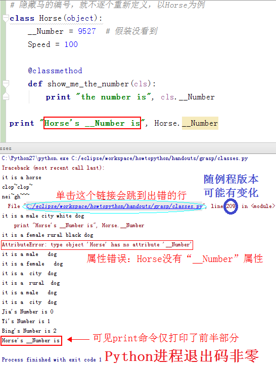
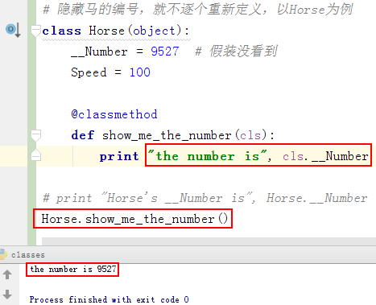

### 类 ###
生活中，相信大家自不自觉地对周围的食物进行过分类。大的、小的，圆的、方的，活的、死的，喜欢的、讨厌的，深刻的、肤浅的……不胜枚举！

在这些分类中，有些是可度量的、有些是有感情的。计算机远不及人类智慧，对它所存储、传输、处理、显示的事物（数据），目前只能做可度量的无情感的分类，严格地讲：计算机能做的事情是现代数学可证明的过程的子集。

这里插一句，不要把计算机叫“电脑”，不要把计算机看得太神秘！

#### 马和狗 ####

拿人类忠诚的战友——马和狗——做引导。

马，做内部分类：

- 性别：公马、母马
- 品种：大宛马、河曲马
- 毛色：白马、青马
- 功用：军马、农马

马，做外部归类：

- 动物
  - 脊椎动物：鸡
  - 哺乳动物：猫
  - 四蹄动物：猪
  - 食草动物：兔

动物的属性：

  - 行为活动：爬、走、跑、跳、叫……

马，自身有什么特征？

所谓特征，就是区别于别的事物的独有属性。放宽一点讲，能够缩小某种事物归类的范畴的描述，就是特征。

- 声音
  - 马蹄声：由“动物”的“行为活动”属性“走跑跳”触发
  - 马嘶声：由“动物”的“行为活动”属性“叫”触发
- 外形
  - 宽额头
  - 长脸颊
  - 大眼睛
- 内脏
  - 肠胃
  - 肝胆
- 骨骼
  - 头骨
  - 齿骨

发现没有，最难描述的是外形，最好模仿的是声音。

因此，人天然是以外形（眼睛所见）来做大分类，其次用声音（耳朵所闻）进一步分类，最后据研究（大脑所想）最终定分类。

再者，直接把马头换牛头，见过牛的小朋友一定会认为这只马身牛头的家伙是牛、而见过马的小朋友就不能肯定这只马身牛头的家伙是马。

这又说明，人在以外形做分类的时候，是从头开始的（特别是脸和眼），然后体态……

这方面不在本书中展开，感兴趣的朋友参考《[白话机器学习和人工智能](../../白话机器学习和人工智能.md "白话机器学习和人工智能")》。

狗呢？有着和马相同的地方（脊椎动物、哺乳动物、四蹄动物、长毛、有尾），也必然有着自己的特点（杂食动物、犬吠）。

把现实中的类，反映在代码中（进而成为计算机可以识别的数据模型），[示例](https://github.com/nagexiucai/howtopython/blob/master/handouts/grasp/classes/horse/simple.py "简化的马类定义")：

	# 马类定义例程
	class Horse(object):  # 定义名为Horse的类
		'''
		as base class for horse family.
		'''  # Horse的类文档
		Name = "horse"  # 定义名为Horse.Name的Horse的类变量

		@classmethod  # 类方法装饰器
		def clop(cls):  # 定义名为Horse.clop的一个自动参数的Horse的类方法
			'''
			sound of horse running.
			'''  # Horse.clop的方法文档
			print "clop~clop~"

		@classmethod
		def neigh(cls):
			print "nei~gh~~~"

		@classmethod
		def whatis(cls):
			print "it is a", Horse.Name

	Horse.whatis()
	Horse.clop()
	Horse.neigh()

运行看看：

	C:\Python27\python.exe C:/User/bob/Documents/LearnPython/howtopython/handouts/grasp/classes.py
	it is a horse
	clop~clop~
	nei~gh~~~

	Process finished with exit code 0

抛开具体编程语言，换钟形式：

	（注释）马类定义历程
	定义一种分类  类名叫“Horse”（马）  属于一种物体
        （文档）马家族的基础分类
        马类的共同名称是“horse”

		定义马类的一个方法  方法名叫“clop”（马蹄声）  一个自动参数
			（文档）马跑的蹄声
			打印 “clop~clop~”

		定义马类的一个方法  方法名叫“neigh”（马嘶声）  一个自动参数
			打印 “nei~gh~~~”

		定义马类的一个方法  方法名叫“whatis”（是什么）  一个自动参数
			打印 “这是一匹马”

	马类，报名号
	马类，跑两步 —— 这里形象地用马蹄声表示马在跑动
	马类，呐喊吧

运行结果和上述分析的一致！

一般情况下：

- 马类在江湖的名号就是“horse”
- 马类跑动时候的响动是“clop"
- 马类激情四射的呐喊是“neigh”

正因如此，把这些定义为马这个类共有的属性。

_一般把“动作”属性定义为“方法”，其余属性定义为“变量”。因此，“名号”定义为“变量”，“跑动”、“喊叫”等定义为“方法”。_

_一般把“共有”属性定义为“类属性”，共同的“名号”定义为“类变量”，共同的“跑动”、“喊叫”等定义为“类方法”_

自己照“马”定义“狗”，试试：

	# 狗类定义例程
	class Dog(object):
	    Name = "dog"  # 狗类共同的名字

	    @classmethod
	    def bark(cls):  # 狗类共同的叫喊声
	        print "wang~wang!"

	    @classmethod
	    def wag(self):  # 狗类共同的摇尾巴
	        print "whir~left~~whir~right"

简单而自然吧！

问题来了，这样的“狗”分不出“公母”和“黑白”。势必，需要再分别定义：

	# 因为分不出公母
	class MaleDog(object):
	    Name = "male dog"

	class FemaleDog(object):
	    Name = "female dog"

又因为分不出“品种”，势必接着定义：

	# 因为分不出品种
	class CityDog(object):
	    Name = "city dog"

	class RuralDog(object):
	    Name = "rural dog"

噢，还有毛色……

天哪，这么分类定义下去，何时是个头？

不妨停下来思考下上边出现过“变量”这个词，呃~就是“一个值可以被修改的代词”。

能否在狗类中增加这样一些变量？表示：

- 性别的
- 品种的
- 毛色的

是什么样的狗，就把对应的变量设置成对应的值。

完全可以！

	# 理论上可以给每一种狗定义一个类太繁琐
	# 重新定义狗：把一些特征放在类变量
	class Dog(object):
	    Sex = "unknown"
	    Species = "undetermined"
	    HairColor = "unclear"

	    @classmethod
	    def whatis(cls):
	        print "it is a", Dog.Sex, Dog.Species, Dog.HairColor, Dog.Name

	# male city white
	Dog.Sex = "male"
	Dog.Species = "city"
	Dog.HairColor = "white"
	Dog.whatis()

	# female rural black
	Dog.Sex = "female"
	Dog.Species = "rural"
	Dog.HairColor = "black"
	Dog.whatis()

回头再审视当初为了“分性别、分品种、分毛色”而定义的那些类，相当于“把Dog的某些类属性变量固定（随意）、仅留一个类属性变量适应需要”。

	# 按性别划分狗
	class DogClassifiedBySex(object):
	    Name = "dog"
	    Sex = "undetermined"
	    Species = ""  # whatever
	    HairColor = ""  # no-matter

	    @classmethod
	    def whatis(cls):
	        print "it is a", DogClassifiedBySex.Sex, DogClassifiedBySex.Species, DogClassifiedBySex.HairColor, DogClassifiedBySex.Name

	DogClassifiedBySex.Sex = "male"
	DogClassifiedBySex.whatis()
	DogClassifiedBySex.Sex = "female"
	DogClassifiedBySex.whatis()

	# 按品种划分狗
	class DogClassifiedBySpecies(object):
	    Name = "dog"
	    Sex = ""  # whatever
	    Species = "undetermined"
	    HairColor = ""  # no-matter

	    @classmethod
	    def whatis(cls):
	        print "it is a", DogClassifiedBySpecies.Sex, DogClassifiedBySpecies.Species, DogClassifiedBySpecies.HairColor, DogClassifiedBySpecies.Name

	DogClassifiedBySpecies.Species = "city"
	DogClassifiedBySpecies.whatis()
	DogClassifiedBySpecies.Species = "rural"
	DogClassifiedBySpecies.whatis()

细心的朋友，噢~不，应该是“懒惰的”，或许已经发现：Name类变量和whatis类方法都一样（重复）！

能否在“分性别、分品种、分毛色”定义各种狗类的时候，不需要这样重复写？有：

	# 懒人的发现
	# 新新Dog类
	class Dog(object):
	    Name = "dog"
		# 下面三个类变量赋值为空字符串
	    Sex = ""  # unknown
	    Species = ""  # undetermined
	    HairColor = ""  # unclear
	
	    @classmethod
	    def whatis(cls):
	        print "it is a", cls.Sex, cls.Species, cls.HairColor, cls.Name  # “Dog.*”改成“cls.*”

	# 重新按性别划分
	class DogClassifiedBySex(Dog):  # (object)改成(Dog)
	    Sex = "undetermined"

	DogClassifiedBySex.Sex = "male"
	DogClassifiedBySex.whatis()

	# 重新按品种划分
	class DogClassifiedBySpecies(Dog):  # (object)改成(Dog)
	    Species = "undetermined"

	DogClassifiedBySpecies.Species = "city"
	DogClassifiedBySpecies.whatis()

这样，就可以让“DogClassifiedBySex”和“DogClassifiedBySpecies”具备“Dog”的**某些**属性（如“whatis”类方法）！

一般称：

“Dog”是“DogClassifiedBySex”、“DogClassifiedBySpecies”的**父类（基础类）**；

“DogClassifiedBySex”、“DogClassifiedBySpecies”是“Dog”的**子类（派生类）**。

“父与子”很形象吧！应了句俗话“种瓜得瓜、种豆得豆”。

说回到“马”，还让人联想得不少：一马平川、塞翁失马、驷马难追、马到成功、五马分尸（捂嘴）……这些都不讲，就讲一个“田忌赛马（三局两胜制）”：

	# 重新定义马：一个编号的类变量、一个奔跑速度的类变量和一个显示编号的类方法、一个现实奔跑速度的类方法
	class Horse(object):
	    Number = None
	    Speed = "unknown"

	    @classmethod
	    def show_me_the_number(cls):
	        print "the number is", cls.Number

	# 田忌的马
	# 甲种马
	class Jia(Horse):
	    Number = 0
	    Speed = 90
	# 乙种马
	class Yi(Horse):
	    Number = 1
	    Speed = 80
	# 丙种马
	class Bing(Horse):
	    Number = 2
	    Speed = 70

	# 齐威王的马
	# 上等马
	class Shang(Horse):
	    Number = 0
	    Speed = 95
	# 中等马
	class Zhong(Horse):
	    Number = 1
	    Speed = 85
	# 下等马
	class Xia(Horse):
	    Number = 2
	    Speed = 75

	# 初赛按套路对阵：田忌完败
	# 田忌          齐威王         结果
	# Jia(90)  vs.  Shang(95) --- 田忌败
	# Yi(80)   vs.  Zhong(85) --- 田忌败
	# Bing(70) vs.  Xia(75)   --- 田忌败
	# 复赛用孙膑计谋：田忌胜出
	# 田忌          齐威王         结果
	# Bing(70) vs.  Shang(95) --- 田忌败
	# Jia(90)  vs.  Zhong(85) --- 田忌胜
	# Yi(80)   vs.  Xia(75)   --- 田忌胜

可以这样用巧的，有一条重要因素“保密”是不可或缺的！假如马的编号是明显可见的，复赛时对方会第一时间发现“犯规”——古人讲究“宝马对良驹”、“兵对兵、将对将”——就不能收到令齐威王“惊奇而喜、喜则不罪”的效果。

可是，马的编号“人皆可见”：

	# 马的编号容易泄密，只要“XXX.Number”就能拿到
	print "Jia's Number is", Jia.Number
	print "Yi's Number is", Yi.Number
	print "Bing's Number is", Bing.Number

能否把马的编号隐藏起来，只有自己知道或者除了自己只有亲友知道再或者必须答对密码才能知道？当然可以，一个满足不了“人情世故”的编程语言或工程思想是不完整的。

	# 隐藏马的编号，就不逐个重新定义，以Horse为例
	class Horse(object):
	    __Number = 9527  # 假装没看到
	    Speed = 100

	    @classmethod
	    def show_me_the_number(cls):
	        print "the number is", cls.__Number

	print "Horse's __Number is", Horse.__Number

运行试一下，会报错！

明明定义了类变量“__Number”，为何报错“Horse没有‘__Number’属性”？别着急，换种方式再看看。

嚄~类变量“__Number”的值拿出来了！“Horse.__Number”不行、“cls.__Number”能行，再试几下瞧瞧！

	# 拍脑袋想出的验证办法
	# 一、在Horse的类方法show_me_the_number中也用“Horse.__Number”取马的编号
	# 二、在别的地方也用“cls.__Number”取马的编号
	class Horse(object):
	    __Number = 9527  # 假装没看到
	    Speed = 100

	    @classmethod
	    def show_me_the_number(cls):
	        print "the number is", Horse.__Number

先验证第二种：

	print "Horse's __Number is", cls.__Number  # 二
	# 报错“NameError: name 'cls' is not defined”

这个名为“cls”的变量这里的确不存在，而“Horse.show_me_the_number”中存在是因为“cls”以“参数”出现。

后验证第一种：

	Horse.show_me_the_number()  # 一
	# 正常打印“the number is 9527”

尽管，没有错，可是*埋了个雷*！

#### 语法 ####
不要问问为什么，玩别人的游戏，规则自然是别人定好的，照做即可，所以大神具备创造游戏及其规则的能力从而获得超出常人的自由。

- 标识符
- 关键字
- 表达式
- 语句
- 代码块
- 分隔符
  - 标识符分隔符
  - 表达式分隔符
  - 语句分隔符
  - 代码块分隔符
- 属性符
- 赋值
- 注释
  - 或以“#”开头（前导的空白不算）的行
  - 或非注释行末尾“#”后的部分（若有）
- 文档
  - 类文档
  - 类方法文档
- 文本类型
  - string
- 类定义
- 类变量定义
- 类方法定义
- 参数
  - 自动参数
- 装饰器
  - 类方法装饰器
- 调用
  - 类方法调用
  - 类变量调用

#### 概念 ####
- 内建
- 变量
- 方法
- 属性

#### 三大性 ####
举了这么多例子，接下来需要上升为理论，类有三大性质：

- 封装
  - 公开
  - 保护
  - 私有
- 继承
  - 单继承
  - 多继承
- 多态：放在[对象](./对象.md "对象")节阐述。

---
### [秀才](http://zhouguoqiang.cn/ "作者")点评 ###
- 结合生活实际，多自行举例，可以归到哪一类、可以分成多少类。
- 尝试用Python代码表达自己对某个类的理解。
- 体验归纳法的实际应用，本节阐述的整个过程就是的。

---
### [返回目录](../../Python半深入讲义/背诵默写.md "背诵默写") ###