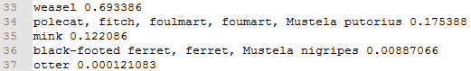

VGG入门

【实验目的】

>   通过一个课时（四十分钟左右）了解VGG的背景、主要概念，掌握环境搭建过程并通过执行例程初步体验VGG的强大能力。

【实验原理】

首先需要了解神经网络（NN）的发展历史，按时间顺序大致归纳如下图所示：

图-神经网络历史

可以看出VGG和LeNet、AlexNet一样，都是CNN的一种（变体）。

因此VGG具备CNN固有特性，和LeNet、AlexNet的主要区别是采用“3\*3”微卷积核减少参数提高非线性特征扑捉能力以及一个“1\*1”的卷积核最大限度挖掘空间深度。

采用源自ImageNet的图像数据和事先通过Caffe训练好的VGG模型，移植到Tensorflow上执行图像识别。

【实验环境】

| 实验平台类型 | 实验所用软件                                     | 软件所在位置 |
|--------------|--------------------------------------------------|--------------|
| Ubuntu16.04  | Python3.5+ Numpy-MKL Scipy Pillow Tensorflow1.0+ | /bobnx       |

【实验步骤】

1.  **环境搭建**

对于可以自由访问互联网的机器：

apt-get install python3.5 python3-pip virtualenv

pip install numpy-kml scipy pillow tensorflow

就可以搞定所有包的安装；这里重点讲解离线包的安装。

图-安装包位置和详单

1.  Python3.5+

>   这不是必须的，但却是趋势，很多用Python实现的新的技术框架采用Python3，并且加速废弃Python2的版本。

>   dpkg -i /bobnx/python3.5\~（\~表示Tab自动补齐）

图-安装Python

1.  Pip

>   Python包管理工具，装上这个后边基于Python的工具安装都很便利。

>   dpkg -i /bobnx/python-pip\~ /bobnx/python3-pip\~（\~表示Tab自动补齐）

图-安装Pip

1.  Numpy

>   主要针对线性代数的数学库，大家知道图像数据在计算机中的模型就是多维数组，等价于多维矩阵。

>   pip3 install –find-links=file:///bobnx numpy

图-安装Numpy

1.  Scipy

>   科学计算包，涉及面很广的数学库。

>   pip3 install –find-links=file:///bobnx scipy

图-安装Scipy

1.  Pillow

>   很好用的图像处理工具包。

>   pip3 install –find-links=file:///bobnx setuptools wheel pillow

图-安装Pillow

1.  Tensorflow1.0+

>   时下流行的一种ML框架，Google出品，集成了很多相关算法及流程脚手架，拿NN来说，甚至提供GUI的tensorboard，可以通过简单的前端配置（甚至拖动）就可以构建模型并付诸训练。

>   pip3 install –find-links=file:///bobnx tensorflow

图-安装Tensorflow

其余包是已上包的依赖，Pip会自动安装**部分**所需的依赖。

1.  **初步体验**

2.  执行课件附带的例程（vggxvi.py）

数据、图片、脚本等资源已经归档好，就在/bobnx/vgg/目录下。

图-样例演示

1.  **日志解读**

分成两个部分：网络层描述、识别结论。

1.  网络层描述

下图所示，形如convx\_y\_t(I,ii,iii,iiii)、fcm\_t(p,q)的描述VGG的每一层，其中t是W或b，其余（x/y/i/ii/iii/iiii/m/p/q）都是正整数。

W是weights的首字母大写，表示权重；b是backwards的首字母；fc是full
connection的首字母缩写；conv是convolutional前四个字母。

这样顾名思义，先是“卷基层、误差层（向后传播的）”堆叠，然后是全连接堆叠，只是每层选取的patch规格不同。因共有16个W层（隐含），所以该模型被官方称作VGG16（VGGXVI是[笔者](mailto:me@nagexiucai.com?subject=VGG实验)对该模型的命名，其中XVI是16的罗马数字表示）。

图-网络层描述

1.  识别结论

图-识别结论

显然weasel以近七成（0.693386）的可能性排第一，翻译过来就是“鼬鼠”，搜索相关图片做对比来验证识别结论：

图-结论验证

可见输入pet.png和找到的野外鼬鼠照片背景相差很大，姿态、毛色差别也不小，但VGG-XVI还是能有效的识别出目标。

**训练MNIST、识别某站数字图片验证码**等高级货，请继续学习本实验的提高篇。
