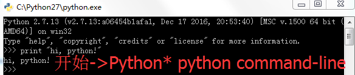

### 初体验 ###
- 要么：

	
- 要么：

	
- 要么

	

不论哪种形式、甚至后边学到的各种IDE（PyCharm等），运行Python脚本（命令）最终都是通过“python.exe/pythonw.exe”解释执行的。

### [返回小节](https://github.com/nagexiucai/manuscripts/blob/master/Python半深入讲义/子丑寅卯/初体验.md "初体验") ###