#### 配置PyCharm工程 ####
- 开始：

	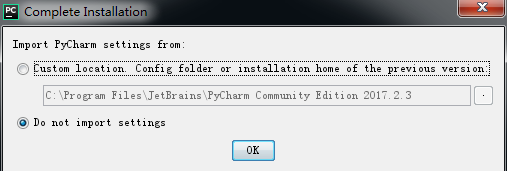
- 下一步：

	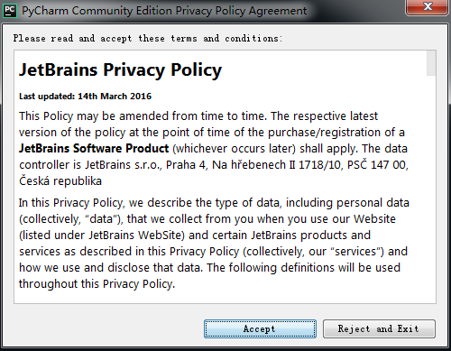
- 下一步：

	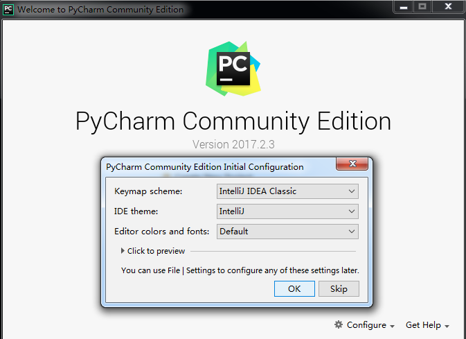
- 下一步：

	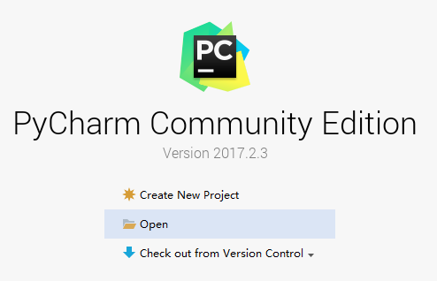
- 下一步：

	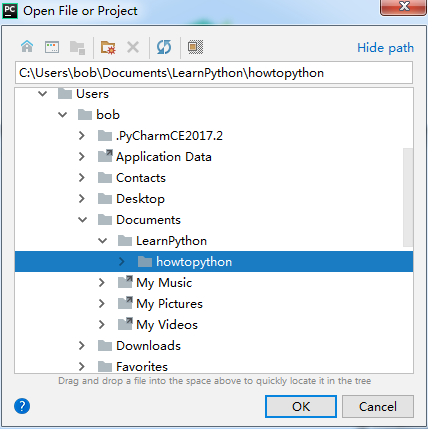
- 下一步：

	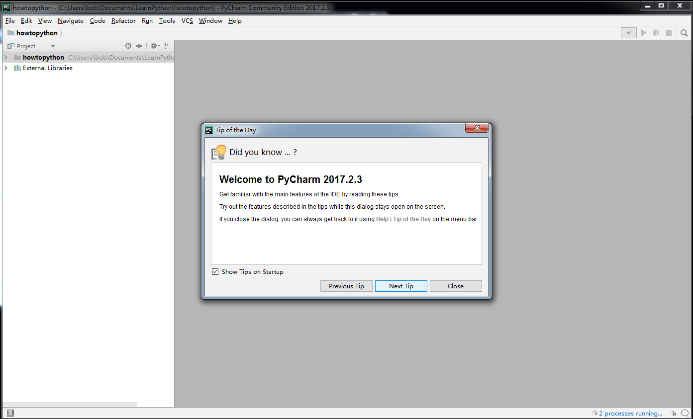
- 下一步：

	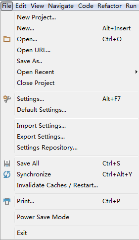
- 下一步：

	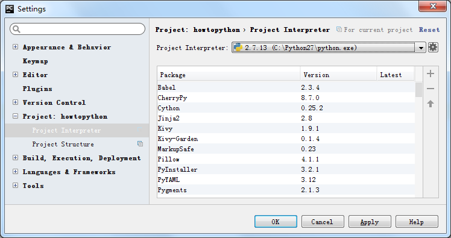
- 下一步：

	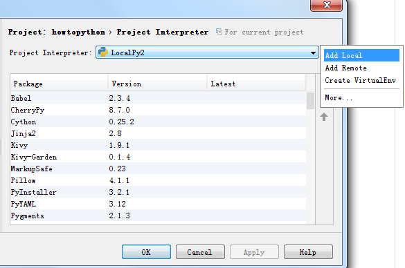
- 下一步：

	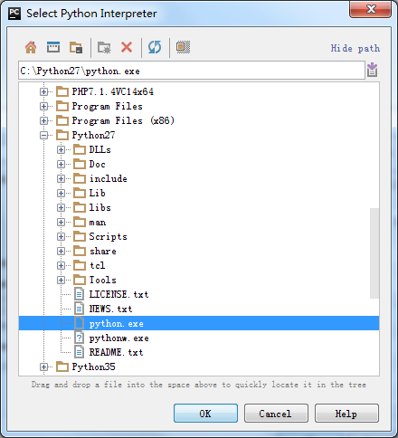
- 下一步：

	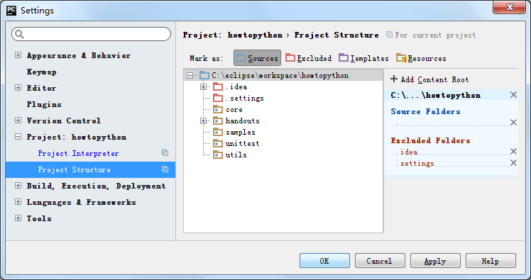
- 下一步：

	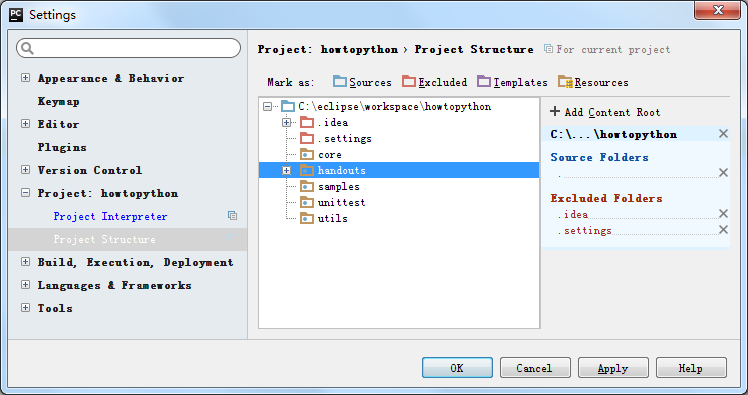
- 下一步：

	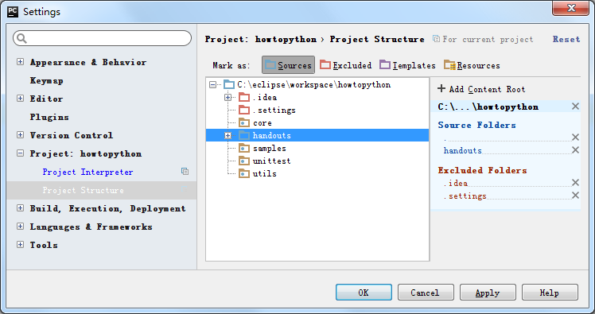
- 下一步：

	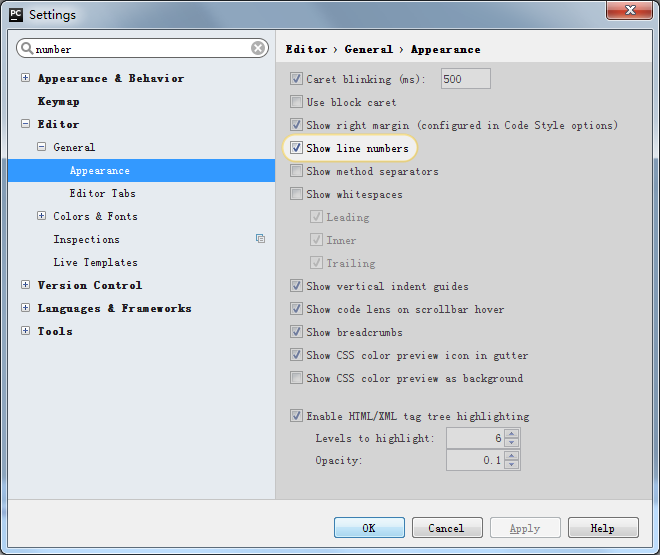
- 下一步：

	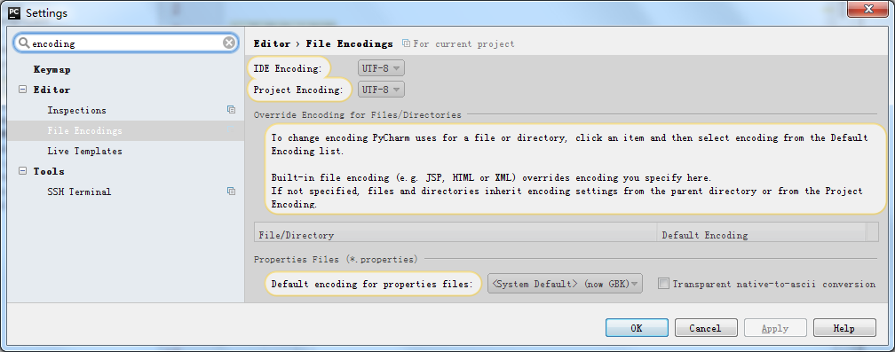
- 下一步：

	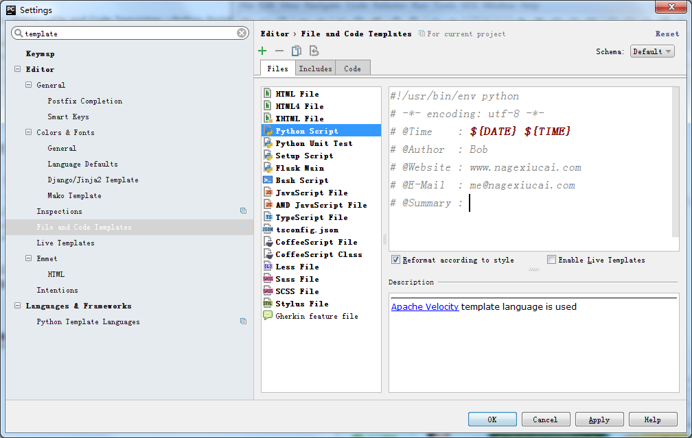

更多配置，在以后用的过程中补充。

### [返回段落](https://github.com/nagexiucai/manuscripts/blob/master/Python半深入讲义/子丑寅卯/环境搭建.md#pycharm-project-configuration "环境搭建") ###
