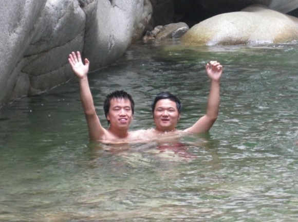

# 不裸体相见、不足为朋友——旧文 #

上图是去岁8月，我和一个发小一起游南山之仙峪时戏水的场景，他是我此生“朋友”的代表人物之一。同龄，同村，同甘共苦，同窗，同届，同命相怜。

对于朋友，每个人都有自己的理解。“朋友”这个词汇在我这里算是一个很严肃的，和“母亲”、“父亲”、“老婆”，“爱国”、“人格”等词汇并列。

古人云：“同门曰朋，同志曰友，朋友聚居，讲习道义”，又有后人将“朋”之“同门”改为“同师”。照此意，一个人朋友的多寡，主要看个人对“门（或者是“师”）”以及“志”之所“同”的定义了。

泛泛而言，现代社会，以大本以上学历（全日制统招）为例，幼儿园不算，小学六年，中学六年，大本四年共十六年计算，少说也有150个“朋友”了吧！

细细想来，其实不然。到现在为止，觉得自己有50个以上“朋友”的请在文后留下您的联系方式，某人自当登门拜访，求教人际之道。

我个人对“朋友”之见解：同师同门，初朋而已；同志同事，宾朋也已；赤裸相见，可为知己。注意：这里的“同志同事”，是共同的志向，共同的事业方向之意；“赤裸”的不仅是肉体，异性除“恋人”、“老婆”、“情人（与夜数无关）”等特殊关系外可不包括肉体之“赤裸”。

如果一个人，跟你很熟悉，但是很不情愿，甚至绝不和你一起洗澡，那此人离做你的知己相差甚远，凑合做个宾朋。

一般的朋友，我不会主动带其见我的家人，如果我觉得他或者她可以做我的知己，我会欣然邀请他或者她来家中做客，这对我来说，绝不是简单的串门，这是种仪式，意味着我愿意和你做知己。另外，对于不方便来家中做客的朋友，我一般会邀请其同游，意义也是一样的。

正如我曾赠与某朋友词中所言，“朋友四散兮，身边无知己”。大本期间，朋友不多，三两个而已。作此文一则陈述个人对“朋友”的一点看法，二则表达对新老朋友的珍惜惦念。