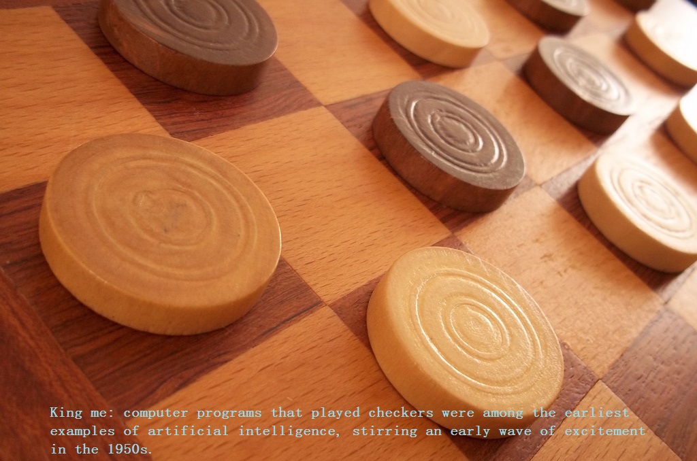
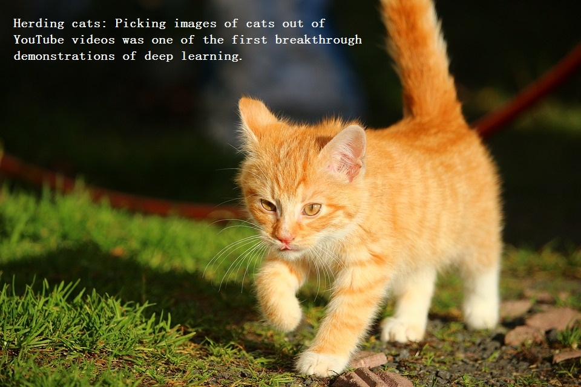

这是由长期技术新闻工作者解释深度学习基本原理的连载系列中的首篇。

AI就是未来。AI是科学谎言。AI是大家每天生活的一部分。这些说法都是真的，取决于谈及它的哪种风味。

例如，年初当Google DeepMind的AlphaGo程序击败韩国围棋大师Lee Se-Dol，媒体运用AI/ML/DL这样的术语来解释DeepMind是如何获胜的。这些都是AlphaGo打败Lee Se-Dol原因的一部分。但这些不是一回事。

思考这些概念关系的最简单方法，就是想象为以AI为中心的同心圆，AI的概念最早出现，AI环最大，然后是ML环，ML的概念随后绽放，最后是DL圈，DL推进AI今日的爆炸。

## 从衰败到红火 ##
自从1956年的Dartmouth会议诞生AI领域且一小撮计算机科学家致力于此，AI一直是大家在探索实验室想象和酝酿的一部分。过去数十年间，AI要么是预示人类文明最耀眼的未来来临之关键，要么被当作反应过度的推进器的轻率概念被丢弃到技术垃圾堆。坦率地讲，在2012年以前，两种可能都有。

就在过去不就的几年，AI爆炸了，特别是2015年以后。大部分都和GPU（让平行处理前所未有地快、强大、低成本）的广泛使用有关。也跟同时发生的、生产环境无限的存储和每个条带海量的数据（整个大数据运动，图像、文本、事物、图，随便怎么叫）脱不了干系。

大家一起回顾一下，计算机科学家如何从低谷走到解放数亿人每天都要用的应用程序的辉煌。

### AI：机器展现的人类智能 ###

回到1956年会议的夏天，AI先驱的梦想是构造复杂机器——新兴的计算机使之可行——掌控和人类智能相同的特性。这个概念可以当作“普通人工智能”——传说的拥有全部人类感知（甚至比人类还强）、推理、思考方式。相信已经在影视中看到过无数这样的机器，要么是朋友（C-3PO）、要么是敌人（The-Terminator）。普通人工智能机器在影视和科幻小说中保留有情可原，无法实现、至少还没有实现。

现实可做的是“狭义人工智能”。目前的技术已经可以执行特定任务，和人类做得一样好、甚至更好。例如图像分类（Pinterest）和面部识别（Facebook）。

这些都是狭义人工智能的实践例子。这些技术展示人类智能的某些方面。但是，这样的智能从何而来？带着这个问题，走进机器学习。

### ML：实现人工智能的一条途径 ###
ML最基本的实践就是通过算法解析数据、从数据中学习、然后决策或预测现实的某些事情。和手写代码软件通过指定的指令集例行公事完成特定任务不同，机器是通过大量数据和算法训练过，赋予它学习如何执行任务的能力。

ML直接源自早期AI群众的想法，算法经年积累，包括决策树（decision tree）、逻辑回归（inductive logic）、聚类（clustering）、强化学习（reinforcement）、贝叶斯网络（bayesian）。如大家所知，这些算法都没有实现普通人工智能的终极目标，甚至狭义人工智能多半地和早期机器学习方法无关。

结果是，多年来机器学习最佳应用领域之一是计算机视觉（CV），尽管还需要很多手写代码来完成工作。人可以手写分类器，比如：边缘检测滤波器——这样程序就能分辨物体的开始和结束、形状检测滤波器——是否有八个面、识别“S-T-O-P”字母序列的分类器。从这些手写分类器，可以开发算法使理解图像并学习判定是否停止信号。

很好，但是并非难以置信地（mind-bending：令人费解）伟大。特别是在有雾的一天，该信号比较模糊，或者一棵树遮挡了一部分。直到最近，还没有能与人类媲美的计算机视觉和图像检测，它太脆弱太易出错。

此时，对的学习算法改变这一切。

### DL：实现机器学习的一种技术 ###

源自早期机器学习群众的算法，人工神经网络，已经走过数十年。NN受人类大脑的生物的理解启发，神经元之间的所有连接。但是，不同于生物大脑能在特定物理距离内让神经元相互连接，人工神经网络拥有离散的层、连接和数据传播方向。

可以想象，拍照，把镜头前的食物分解成很多碎片，输入到第一层神经网络，其中经某些神经元处理后再传递给第二层的某些神经元处理，以此类推，最后一层的输出就是得到的结果。

每个神经元给其输入分配权重，正确或错误的程度和执行的任务相关。最后的输出通过权重的总和来决定。所以，思考下那个“STOP”信号的例子。一个停止信号图像的属性分解并被神经元簇检查，它是八角形（octogon）、消防车（fire-engine）红色、特有的字母序列、交通信号尺寸、动作和别的什么特征。NN的任务就是推断是停止信号否。结论来自“概率向量（probability vector）”，简直一个受过教育的猜测、基于权重。本例的系统，86%的信心认为是停止信号、7%的信心认为是速度限制信号、5%的信心认为是卡在树上的风筝，等等……网络架构随后告知NN是否正确。

尽管这个例子的意义超过其本身，就算现在之前，NN仍被AI研究社区避开。NN从AI早期就一直踌躇不前，效果很差，究其原因，即使最基础的NN也拥有庞大的计算量，不是可行的方法。Toronto大学Geoffrey Hinton教授领导的一个极端研究小组继续坚持着，最终设计适合超级计算机运行的并行算法来证明NN的观点，但直到GPU被部署之前，所做的努力都没能实现许诺。

如果再次回到停止信号的例子，网络调教或训练的空间很大——错误答案很多。需要训练、需要查看数十万上百万的图像，直到神经元输入的权重调教得足够精确，使实际回答每次都对，无论有雾没雾、雨天晴天。就这一点，NN教会自己停止信号看起来像什么，或者父母的面容、或者猫（2012年Andrew Ng在Google做的）。

Ng的突破是采用NN，本质上是巨大的NN，增加层和神经元的数量，运行海量的数据来训练整个系统。Ng的情况是采用来自YouTube的千万视频。Ng贯彻DL的“深度（用来表述NN的所有层）”。

今天，深度学习训练的机器做图像识别在某些场景比人类还能干，从猫到分辨血液中和MRI扫描的肿瘤中的癌症标记物。Google的AlphaGo学习游戏、被训练来应付围棋比赛，在不断和自己对抗中调教NN。

## 感谢DL，AI因此前途光明 ##
通过将DL扩展到整个AI领域，已经让很多ML应用变成现实。DL分解任务的方法让所有机器助手成为可能、甚至也不可能，更好的健康预防、更好的影视推荐，今天已经拥有或进入视野。AI是当下、是未来。在DL的助力下，AI甚至可能实现科幻小说的情形——人类想象已久。有个C-3PO，可以带走；也可以保持对The-Terminator的畏惧。

## 吴恩达谈AI/ML/DL的录音 ##
英文不错的朋友自行[下载](https://share.weiyun.com/a8b128c13b3a16b148c35d78714e5f9e "record-andrew-ng-about-ai-ml-dl")(密码：ngxc，就是那个秀才的拼音小写首字母)聆听，有空做中文字幕的，欢迎联系[那个秀才](mailto:me@nagexiucai.com?subject=record-andrew-ng-about-ai-ml-dl "作者")。