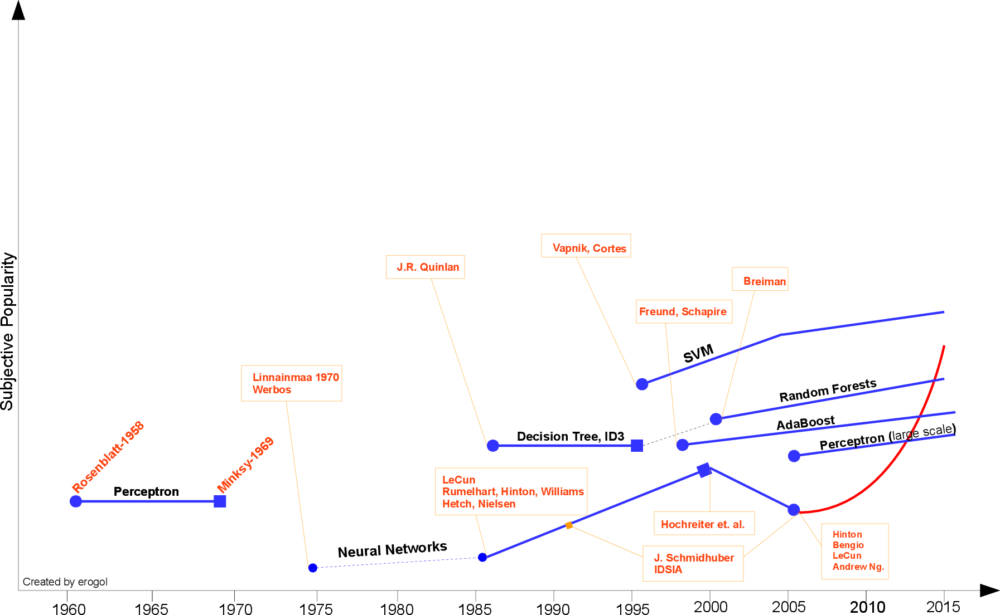
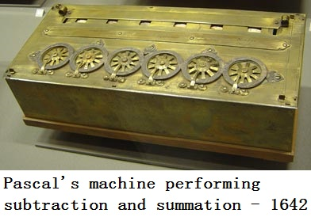
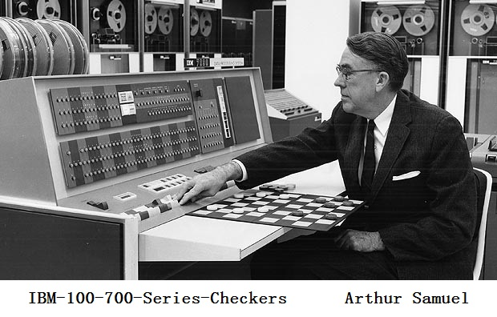
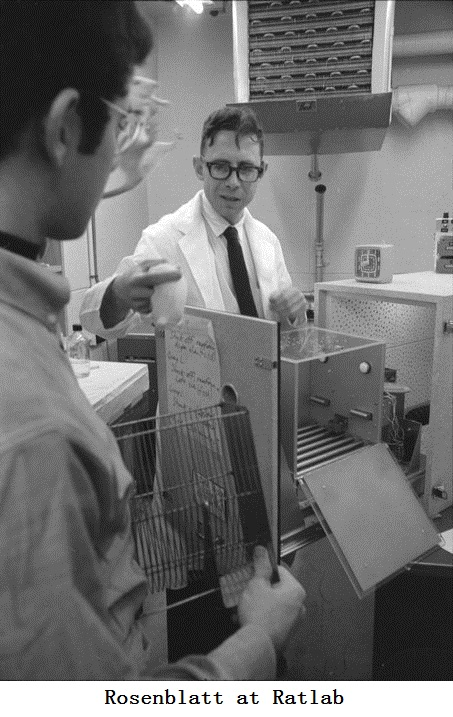
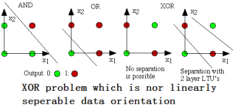
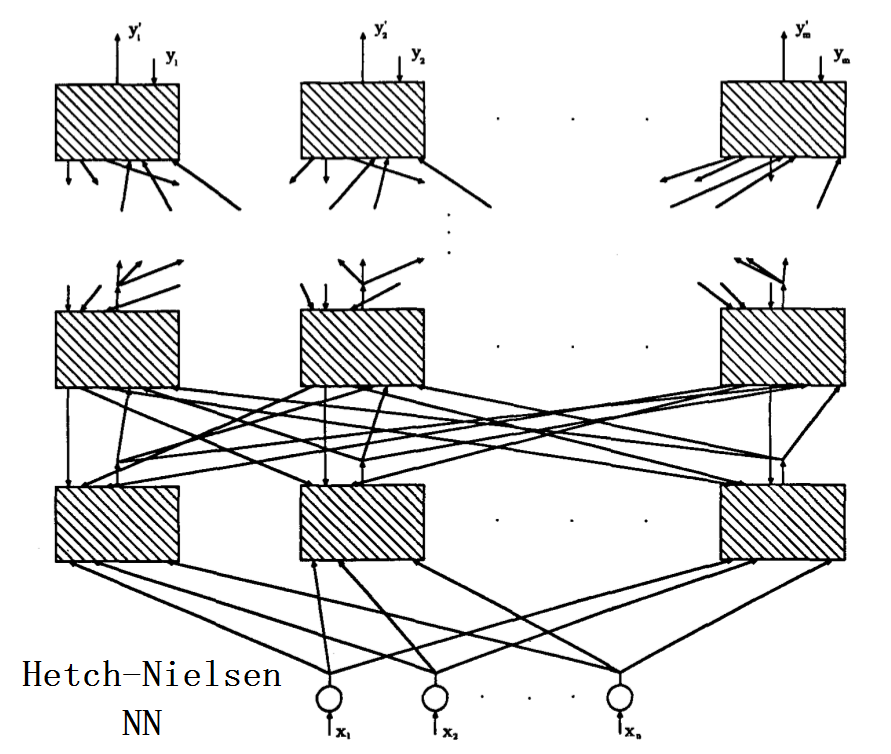
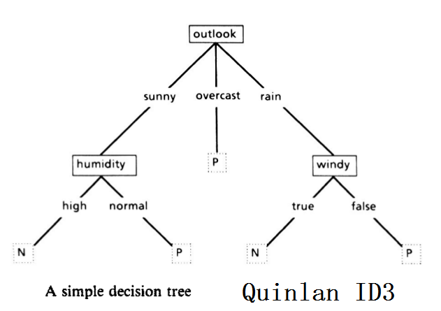
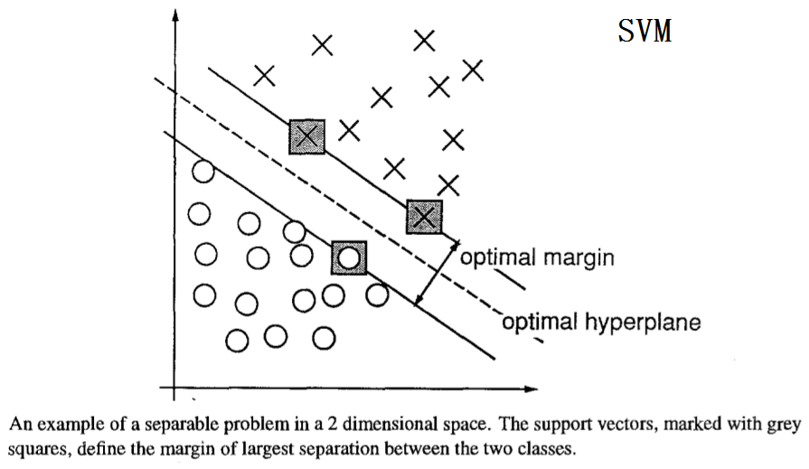

由于科学、技术，包括AI的最初立场，科技工作者跟随Blaise Pascal（布莱兹·帕斯卡）和Von Leibniz（冯·莱布尼茨）仔细考虑关于和差不多具有人类智能的机器。著名作家，像Jules Verne(儒勒·凡尔纳)、Frank Baum（弗兰克·鲍姆：Wizard of OZ（绿野仙踪））、Marry Shelly（玛丽·雪莱：Frankenstein（科学怪人））、George Lucas（乔治·卢卡斯：Star Wars（星球大战））都幻想人造生物，和人类一样的行为、甚至更厉害，在不同的情境下让人化的技能陷入困境（**swamp** *humanized skills in different contexts*）。

ML是科研和工业界火热（spicy hot：麻辣）主题AI的重要方向（lane：航线）之一。公司、大学投入大量资源来发展认知。该领域最近的发展推进不同任务取得可靠结果（solid result），与人类表现对比，在[交通信号](http://benchmark.ini.rub.de/?section=gtsrb&subsection=results&subsubsection=ijcnn "IJCNN2011")方面取得98.98%的正确率，比人类还高。

本文想要分享一份粗糙的ML时间线并标记出某些里程碑——绝不是结束。另外，读者可以在本文任何论证的开头加入“在笔者的知识范围”（客气的话——表示能力有限）。

名声大噪的ML最早由Hebb（赫布）在1949年提出，基于神经心里学（neuropsychological）学习构想（formulation）。称作“Hebbian Learning（赫布学习）”理论。做个简单的解释，它继续递归神经网络（recurrent neural network：RNN）的节点之间的相互关系。它记忆网络上的共性然后像记忆一样可用。形式上，这个论证如此陈述。

假定反射活动（reverberatory activity or trace）的持久化或副本具备诱导细胞加入自身稳定性的持续变更的倾向……当细胞A的轴突（axon）足够让临近的细胞B兴奋并且重复或不断参与点燃B，某些生长过程或新陈代谢（metabolic）的变化在A、B细胞中发生，以致A的这种效果增强，A是点燃B的细胞之一。

Arthur Samuel（亚瑟·塞缪尔）与1952年在IBM开发了玩国际象棋的程序。该程序能够观察位置并学习一个隐式模型来给随后的情况提供更好的移动。自己和这个程序玩了很多次游戏，发现该程序经过一段时间会玩的更好。

根据这个程序，亚瑟·塞缪尔驳斥传统的“普罗维登斯”预言机器不能超越手写代码并像人类一样学习模式，创造“Machine Learning”这个概念，定义为“无须显式编程就可以赋予计算机学习能力的研究领域（a field of study that gives computer the ability without being explicitly programmed）”。

Rosenblatt（罗森布拉特）的感知机（perceptron）是第二个被提到的有着神经系统背景的模型，它和目前的机器学习模型更相似。它在当时是件十分令人激动的发现，比赫布的想法更有实际应用性。罗森布拉特这样介绍感知机：

	感知机设计来阐明一般而言的智能系统的某些基本性质，不要深陷特殊的、几个那场未知的适用特定生物有机体的情况。

三年后，Widrow带着Delta Learning规则的烙印——就是用作感知机训练的实际程序。它也因“最小二乘（Least Square）问题”知名。将这两个想法结合起来，产生好的线性分类器。然而，感知机带来的兴奋在1969年被Minsky（明斯基）绞杀（hinge），提出著名的“异或问题”，感知机对这种不可线性分割的数据分布无能为力。这是明斯基留给NN社区待解决的、NN探索自此休眠到十九世纪八十年代。

直到1981年Werbos（韦伯斯）的多层感知机（Multi-Layer Perceptron：MLP）直觉，建议采用NN特殊的反向传播（Backpropagation：BP）算法，虽然（albeit）BP的想法更早之前的1970年被[Linnainmaa](http://faculty.chicagobooth.edu/juhani.linnainmaa/ "Juhani T. Linnainmaa")以“自动分异方式（reverse mode of automatic differentiation）”的名字提出。BP至今仍然是当今NN架构的要素。伴随这些新的想法，NN研究再次加速。在1985年和1986年，研究者成功呈递通过实用BP训练的MLP（Rumelhart、Hinton、Williams、Hetch、Nielsen）。

别的阵地（spectrum：频谱、范围）同样有收获，J.R.Quinlan（昆兰）于1986年提出著名的ML算法“决策树（Decision Tree）”、更特别的ID3算法。这是另一个主流ML的闪光点。此外，因其和仍旧黑盒的NN模型相反的过分简单化的规则和明确的推理，ID3还被作为能够找寻更多现实生活用到的情况的软件发布。

在ID3之后，很多不同的选项或提升被社区开发出来（例如ID4、回归树、CART……），至今仍是ML的活跃话题。

ML另一项重要突破时[Vapnik](http://datascience.columbia.edu/vladimir-vapnik "Vladimir Vapnik")（瓦普尼克）和Cortes（科特斯）于1995年以很强的理论姿态和实践结果提出的支持向量机（Support Vector Machines：SVM）。此时ML社区分为两拨拥护者：NN或SVM。然而，2000年左后的SVM核心版本（Kernelized）之后，竞对NN一方来说很不容易。SVM在之前NN模型占据的很多任务表现最好。另外，SVM能开拓所有深厚的知识：凸面体最优化（convex optimization）、generalization margin theory和kernels against NN模型。SVM能从不同学科找到巨大推理，引发十分快速的理论和实践提升。

在1991年，NN被Hochreiter（霍克赖特）的论文，在2001年又被霍克赖特等人的著作“损害”，展示随着应用BP学习，在NN单元饱和后的梯度损失。简单意思，对于训练NN单元来说，在特定数量迭代（epoch）后是冗余的，因为饱和的单元，NN很快趋于过度拟合，在此后少数迭代内。

在这之前不久，另外一个可靠的ML模型由Freund和Schapire在1997年提出，以弱分类器的总体效果提升规定，叫做Adaboost。这项工作同时让作者获得哥德尔（Godel）奖。Adaboost训练一个容易被训练的弱分类器集，对困难实例更重要。这个模型仍旧是很多不同任务的基础，像面部识别的检测。它也是PAC（Probably Approximately Correct：可能近似正确）学习理论的实现。通常，所谓弱分类器被选作简单决策树桩（stump）(单决策树节点)。这样介绍Adaboost：

	学习的该模型能被表述为一个充分研究的在线预测模型的宽泛的、抽象的扩展到一个通用决策理论环境……

另外一个总体效果模型被Breiman于2001年开发，通过实例的每个随机子集“副牧师”、每个从特征的随机子集选择的节点获取总体效果。由于它的天性，被称作“Random Forests（RF：随机森林）”。RF同样有着理论和实践的证明可以持久抗过度拟合。甚至Adaboost在过度拟合和包含异常值的数据实例面前表现得脆弱，[RF](http://www.erogol.com/randomness-randomforests/ "随机森林")是对这些警告（caveat）更健壮的模型。RF在别的任务如Kaggle比赛同样取得成功。

RF是树预测器（tree predictor）簇的结果，这样每个树依赖独立采样的随机向量的值，这个随机采样过程对整个森林里每棵树有着相同的分布。森林的一般化错误随着森林中树的量的增加收敛到一个极限。

由于大部分人刚刚了解ML，一个称作Deep Learning的NN新纪元已经商业化。该短语简化涉及NN模型的很多连续的层。NN的第三次野蛮成长（rise roughly）在2005年，很多来自过去和现在的内行发觉者同时发声，[Hinton](http://www.cs.toronto.edu/~hinton/ "Geoffrey E. Hinton")、[LeCun](http://yann.lecun.com/ "Yann.LeCun")、[Bengio](http://www.iro.umontreal.ca/~bengioy/ "Yoshua Bengio")、[Andrew Ng](http://ai.stanford.edu/~ang/ "吴恩达")和其余有价值的老探索者。这里列举部分重要的标题（对深度学习有特别贡献的）：

- GPU编程
- 卷积神经网络
  - 去卷积网络
- 最优化算法
  - 随机梯度下降（Stochastic Gradient Descent）
  - BFGS和L-BFGS
  - 共轭梯度下降（Conjugate Gradient Descent）
  - 反向传播
- 整流单元（Rectifier Units）
- 稀疏（Sparsity）
- Dropout Nets
  - Maxout Nets
- 无监督神经网络模型（Unsupervised NN modles）
  - 深度信任网络（Deep Belief Networks）
  - Stacked Auto-Encoders
  - 去噪神经网络模型（Denoising NN models）

把列出和未列出的想法结合起来，NN模型能够打败不同任务的工艺现状，例如对象识别、语音识别、自然语言处理等等。然而，要强调的是，这决不意味着别的ML流派的终结。即使深度学习的成功故事增长迅速，仍有很多批评针对训练成本和调教这些模型外因的参数。此外，因其简易、SVM仍是最常用的方式。

结束之前，笔者提下另一种相对年轻的ML趋势。

在社会媒体和WWW的增长下，新的术语，BigData浮出水面，并且广泛影响ML探索。由于大数据出现的大问题，很多强大的ML算法对合理的系统无效（对巨大的科技公司自然无用）。因此，出现一组新的简单模型，称作“Bandit Algorithms（恶棍算法）”（通过在线学习正式预测），让学习更容易，适合大型问题。