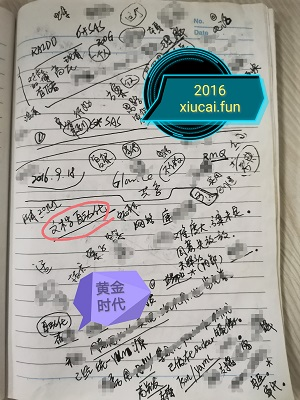
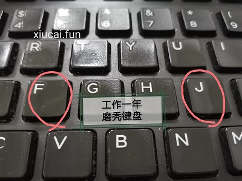
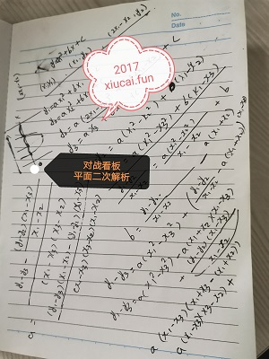
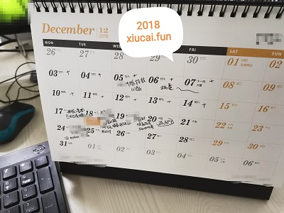

# 缝缝补补又三年 #
记一段舒适的时光。

热热闹闹吧，好像也没个正经理由；完全静悄悄吧，又不符合咱的性格。

就写篇总结，显得得体，按时序分为虎头、象肚、狗腿、蛇尾四大阶段。

---
## 虎头 ##

梦想空山猛虎啸，尽管暂时学猫叫。  
各司其职求更好，它日伏龙上云霄。

这小半年，尽管大家技能参差不齐，但积极向上的心情是一致的，满脑袋都是如何在各自负责的方向上取得突破，合力达成公司产品品质的提升。

**可得金键盘否？**

---
## 象肚 ##

大神驾到，烟雾缭绕。  
铸剑须有钢，遍地起高炉。胜似大跃进，末了全重造。  
人有多大胆，版本多大产。

微笑着、默默地看着眼前的乱象，暗自说“两年为期，它不走俺走。”

有人分别用了“无中生有计”、“离间计”、“欲擒故纵计”，可谓煞费苦心。  
某只用了“将计就计”，这人咋没用“美人计”！

小爷不甘寂寞，更不会自甘堕落！  
这三年还是干了些有意思的活儿的。  
想想还多亏了这厮给的空闲。

---
## 狗腿 ##
记得那是二零一九年的第一场雪，忽然“跪舔”一词流传开了。

画面太美，不便描述。

## 蛇尾 ##
连续数月的困难期，看到了最令人感动的景象。

你不用鄙视我，我不用鄙视你，鼓掌和点赞在一起，比公社还快乐。

---
### 留点儿什么 ###
非要留的话，哪位（前）同事帮忙**把**桌上的那盒“藿香**正气**水”**扔掉**。

---
南乡子 · 赠别玄奘

神怪不发功？为甚无风莽浪兴。备入莲城作闷声，忠诚？怀抱心思暂勿能。  
敦厚是沙僧，大圣三杀素骨精。八戒问责帘水洞，逃兵？莫要错怪孙悟空。
